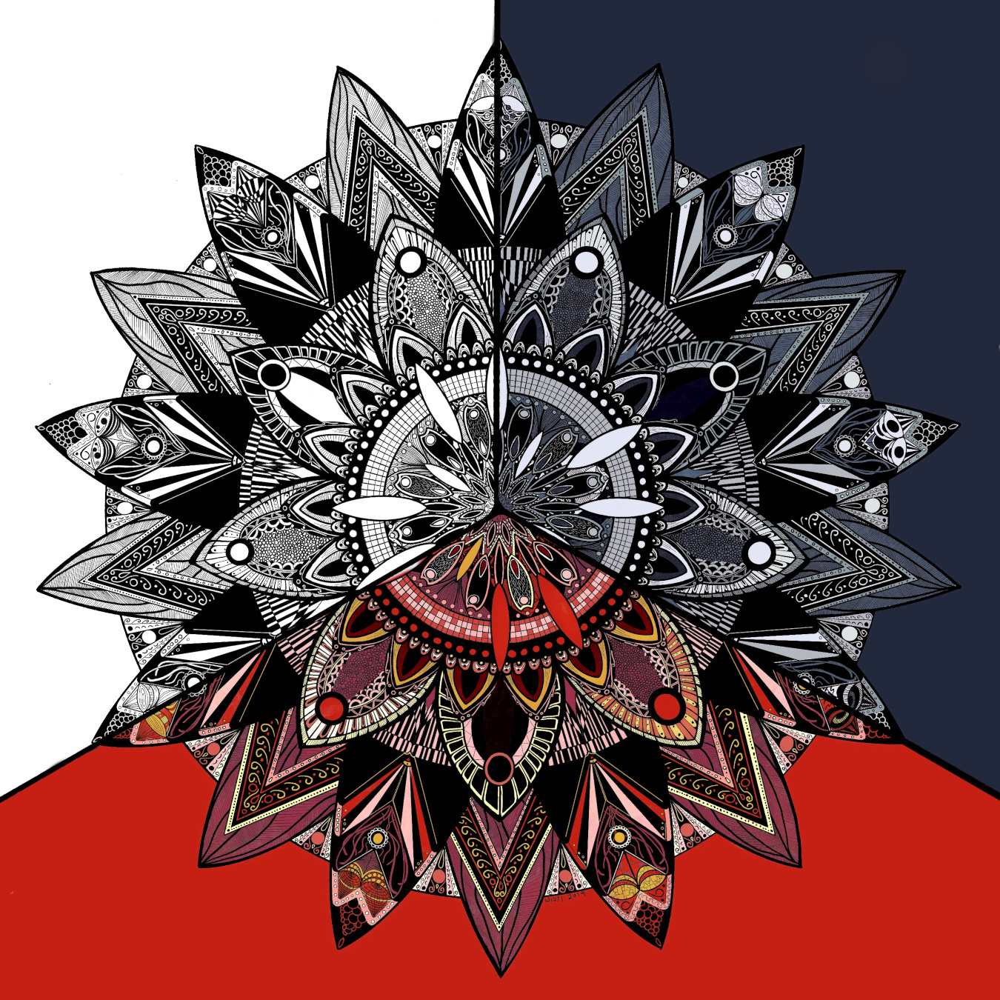

---
aliases:
- /note/2019/349/again-with-the-manual-symmetry/
- /note/2019/12/again-with-the-manual-symmetry/
category: note
date: 2019-12-15 12:37:51-08:00
slug: again-with-the-manual-symmetry
syndication:
  mastodon: https://hackers.town/@randomgeek/103313897978144046
  twitter: https://twitter.com/brianwisti/status/1206324135858716678
tags:
- drawing
- procreate
- symmetry
title: Again with the manual symmetry
---

I spent forty hours over the last month or so *inbox/Drawing* this.

Couldn’t decide which aspect I liked best. Line work? Color? Values? So
I went with all three.

On another note, I kinda want to study more about image formats. JPEG
clearly has some issues with the red. PNG is unacceptably large thanks
to all the detail work.
