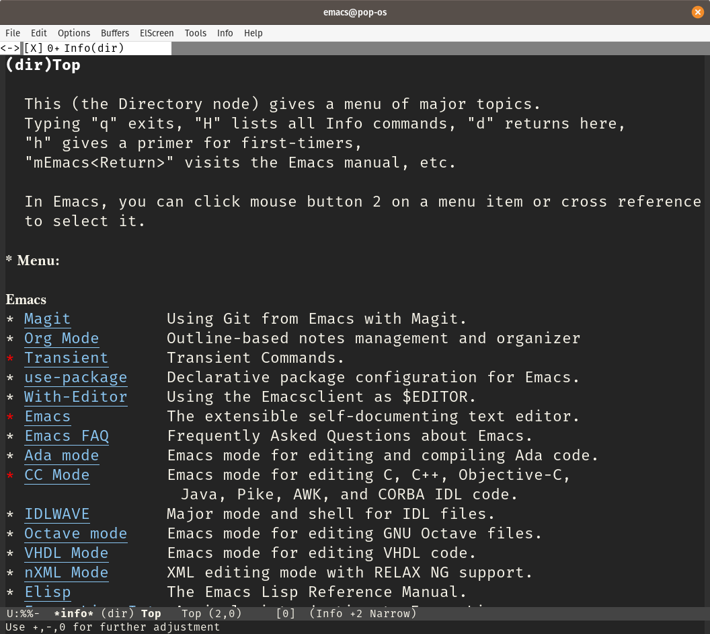

---
aliases:
- /2019/12/01/installing-emacs-documentation-on-pop_os/
category: post
date: 2019-12-01 11:11:00-08:00
description: Apt spells "emacs core docs" as "emacs-common-non-dfsg".
slug: installing-emacs-documentation-on-pop-os
syndication:
  mastodon: https://hackers.town/@randomgeek/103234200410596678
  twitter: https://twitter.com/brianwisti/status/1201223206339776512
tags:
- emacs
- linux
- info
- tools
title: Installing Emacs Documentation on POP!_os
---


Emacs Info (zoomed with `text-scale-adjust`)

On a Linux flavor like [Ubuntu](https://ubuntu.com/) or [Pop!\_os](https://system76.com/pop) which uses [`apt`](https://en.wikipedia.org/wiki/APT%5F(software)) for package management? Trying to find the built-in [Emacs](../../../card/Emacs.md) documentation so you can read it without going online? Install [`emacs-common-non-dfsg`](https://packages.debian.org/jessie/emacs24-common-non-dfsg).

````
$ sudo apt install emacs-common-non-dfsg
````

It’s a license thing. The [GNU Project](https://www.gnu.org/) distributes the core [Emacs](https://www.gnu.org/software/emacs/#Manuals) documentation under the [GNU Free Documentation License](https://www.gnu.org/licenses/fdl-1.3.html). [Debian](https://www.debian.org/) decided [years ago](https://www.debian.org/vote/2006/vote%5F001) that the GFDL didn’t meet the [Debian Free Software Guidelines](https://www.debian.org/social%5Fcontract#guidelines). It’s still available – in the non-free repo – though they gave it a name I’ll never remember unless I write it down somewhere.

That decision has rippled down over the years. Even though I haven’t used Debian since the early 2000’s, I needed to know it today. Okay I didn’t *need* to know it. I could have just read the [online docs](https://www.gnu.org/manual/manual.html).

I always liked the [Info](https://www.gnu.org/software/texinfo/) reader and consider it a significant feature when going through an Emacs phase. Though yeah – it’s a bit archaic. Honestly that describes most of Emacs. When I want featureful and flashy I can use [Visual Studio Code](https://code.visualstudio.com/) or [Atom](https://atom.io/).

Not even a two hundred word post and I managed to digress. Ah well. Some days are like that.
