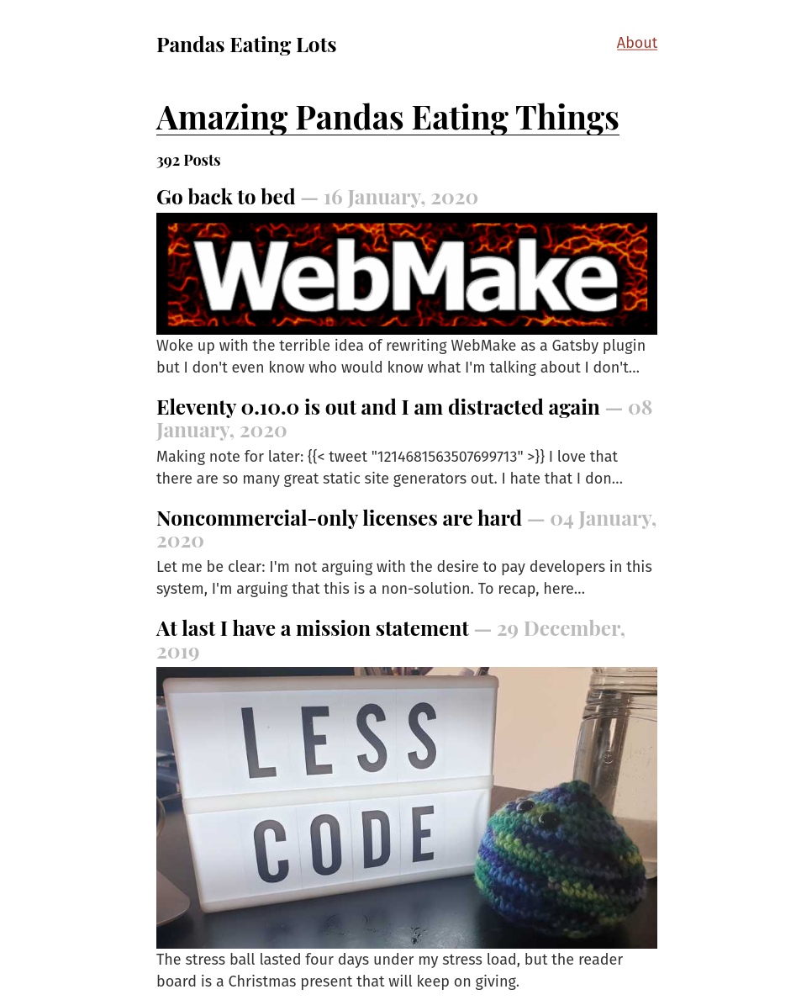

---
aliases:
- /note/2020/24/random-geekery-a-la-gatsby.js/
- /note/2020/01/random-geekery-a-la-gatsby.js/
- /note/2020/01/random-geekery-a-la-gatsbyjs/
category: note
date: 2020-01-24 22:31:00-08:00
slug: random-geekery-a-la-gatsbyjs
syndication:
  mastodon: https://hackers.town/@randomgeek/103542611205444933
  twitter: https://twitter.com/brianwisti/status/1220961620400267265
tags:
- site
- gatsbyjs
- panda-geekery
title: Random Geekery a la Gatsby.js
created: 2024-01-15T15:26:28-08:00
updated: 2024-01-26T11:03:43-08:00
---

Finished the [Gatsby.js tutorial](https://www.gatsbyjs.org/tutorial/). Thought I’d dump the live site’s content into the tutorial site. Fiddled a *little* bit with [gatsby-image](https://www.gatsbyjs.org/packages/gatsby-image/). (It ignored the [card/reStructuredText](../../../card/reStructuredText.md) files, but that’s okay.) I never did change the title.
