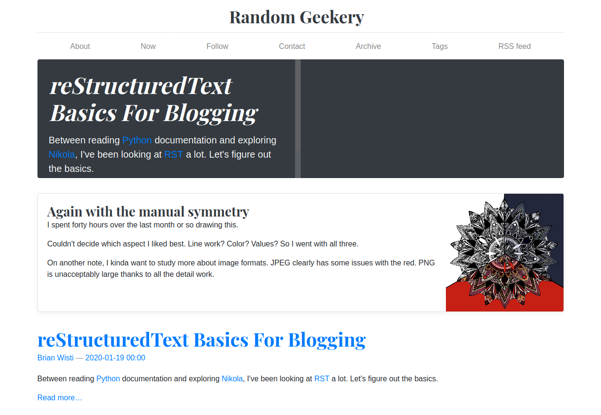

---
aliases:
- /note/2020/20/random-geekery-a-la-nikola/
- /note/2020/01/random-geekery-a-la-nikola/
category: note
date: 2020-01-20 23:01:04-08:00
slug: random-geekery-a-la-nikola
syndication:
  mastodon: https://hackers.town/@randomgeek/103520062263364491
  twitter: https://twitter.com/brianwisti/status/1219518854403100672
tags:
- nikola
- site
- having-fun
- killing-time-while-scripts-run
title: Random Geekery a la Nikola
created: 2024-01-15T15:26:29-08:00
updated: 2024-01-26T11:03:44-08:00
---

Told you I was checking out [Nikola](../../../card/Nikola.md). Importing the live site has been fun. I may have outgrown the default theme though, nice though it is.

No, I haven’t replaced Hugo yet. Just exploring.
