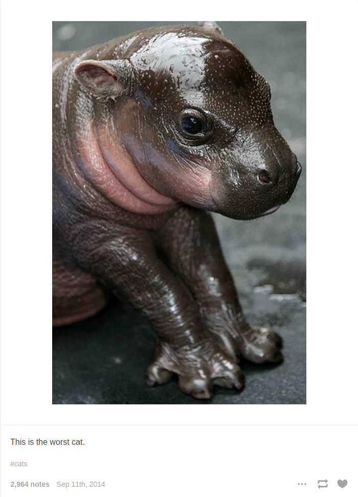

## What is it?

[card/reStructuredText](../../../card/reStructuredText.md) is a [card/Lightweight Text Formatting Language](../../../card/Lightweight%20Text%20Formatting%20Language.md) with a cumbersome name.  You mostly see it in [Python docstrings](https://www.python.org/dev/peps/pep-0287/), because it's the standard format for Python documentation. Through site generators and [Sphinx](https://www.sphinx-doc.org/en/master/index.html), RST also shows up [behind the scenes](https://www.sphinx-doc.org/en/master/examples.html) in blogs, projects, and technical books.

Nothing about RST limits it to technical writing — well except that most nontechnical folks aren't installing special Python libraries to write Hugo posts.

Anyways. The essentials of the RST format are easy enough that it's suited for general writing.

### How do I use RST in my blog?

If you already blog with [card/Nikola](../../../card/Nikola.md) or [Pelican](https://getpelican.com), you are all set. Those site generators natively support reStructuredText.

[card/Hugo](../../../card/Hugo.md) will build `.rst` content if you have `rst2html.py` installed.

````sh
pip install docutils
````

### Editor support

Emacs and Vim both include RST support built-in. Visual Studio Code users can find a \[useful plugin\])(https://marketplace.visualstudio.com/items?itemName=lextudio.restructuredtext). But all you *need* is a plain text editor, preferably with automatic indentation.

### Extracting styles

The HTML generated by `rst2html.py` has its own special classes. My home-grown Hugo theme supports none of those classes, of course. I couldn't figure out how to export the Docutils default stylesheet this morning.

So I made a document and grabbed the CSS rules from there for my own nefarious purposes.

````sh
"hey\n" | rst2html.py >> sample.html
````

## What does it look like?

Although RST is readable, more folks are familiar with [card/Markdown](../../../card/Markdown.md). I know I was more familiar with Markdown when I started this. Once you get the hang of it, you may find that RST has its charms.

### The basics

More than enough to write one of my blog posts.

#### Paragraphs and inline formatting

It all starts with paragraphs. Plan text, separated by empty lines. The text lines of a paragraph are wrapped together.

 > 
 > Indent your paragraph if you want a nice blockquote.

You can *emphasize* text in a paragraph using asterisks. Double asterisks give **more** emphasis. You can wrap multiple words to *emphasize all of them*. I think doing that dilutes the effect, though. You end up with something that looks more like a conspiracy-themed newsletter. But hey. If that's the look you're going for? Have fun!

````rst
It all starts with paragraphs. Plain text, separated by empty lines.
The text lines of a paragraph are wrapped together.

     Indent your paragraph if you want a nice blockquote.

You can *emphasize* text in a paragraph using asterisks.
Double asterisks give **more** emphasis.
You can wrap multiple words to *emphasize all of them*.
````

Use `double backticks` for inline literals — characters displayed in a monospace font and often used to indicate code. This is a little confusing after Mrkdown, which uses a single backtick for literals. But RST uses those for *interpreted text*.

````rst
Use ``double backticks`` for inline literals — characters displayed in a monospace font and often used to indicate code. This is a little confusing after Mrkdown, which uses a single backtick for literals. But RST uses those for `interpreted text`.
````

What's interpreted text? Well, it can mean a few things depending on the context of what's in and around it. You could even define your own with Python. Not today, though.

`rst2html.py` transforms a lone bit of `interpreted text` to `<cite>interpreted text</cite>`. The [citation](https://developer.mozilla.org/en-US/docs/Web/HTML/Element/cite) tag is used in HTML for referencing creative work: books, songs, blog posts.

#### Bullet lists

We already know what a basic bullet list looks like.

* You have some lines
* Each line starts with a special character and a space
* I used `*` but RST allows a few
  * `*`
  * `-`
  * `+`
* The important thing is to be consistent for a list or sublist
  * oh, and you can do sub lists with indentation!
  * but you *need* blank lines between list levels

````rst
- You have some lines
- Each line starts with a special character and a space
- I used ``-`` but RST allows a few

	- ``*``
	- ``-``
	- ``+``

- The important thing is to be consistent for a list or sublist

	- oh, and you can do sub lists with indentation!
	- but you *need* blank lines between list levels
````

#### Links

Links can be simple URL drops, like <https://beatrockmusic.bandcamp.com/>. Or use some interpreted text for a more readable [link](https://bambubeatrock.bandcamp.com). I prefer [reference](https://rockyriverabeatrock.bandcamp.com) links. It even looks nice for [long references](https://prometheusbrown.bandcamp.com/album/tag-init), once you get used to it.

````rst
Links can be simple URL drops, like https://beatrockmusic.bandcamp.com/.
Or use some interpreted text for a more readable `link <https://bambubeatrock.bandcamp.com/>`_.
I prefer reference_ links.
If even looks nice for `longer references`_, once you get used to it.

.. _reference: https://rockyriverabeatrock.bandcamp.com/
.. _longer references: https://prometheusbrown.bandcamp.com/album/tag-init
````

See those last couple lines? Those define link targets. The `..` at the beginning of the line tells RST this is explicit markup. Explicit markup takes us out of the core document flow, letting us use extensions or define values.

For today's goal of basic blogging, this explanation is sufficient.

* `.. _word: URL` or `.. _long word: URL` defines a target
* `word_` makes a link to it.
* for multiword targets, use <tt>
`long name`\_</tt> to reference them.

### A little more

We've got the basics. After these next few items, I have about 80% of everything I ever wrote on this site covered.

#### Headers and sections

 > 
 > \[!WARNING\]
 > Most blog generators demote your headers by at least one level. That way your post title goes at the top of the hierarchy. It also means that my level three section headers generate `<h4>` tags! So don't go overboard with subsections.

You've been looking at section headers already, so it seems silly to put examples here. Plus it messes up the document structure.

You need two lines to make a section header. The text of the header itself forms the first line. Use the text of the header itself for the first line. In the second line, put enough non-alphanumeric characters to match your header's length. Pick any you like — well, any from the set of `= - : " ~ ^ + * + # < >` — as long as you stay consistent.

````rst
What does it look like?
=======================

section 3
````

First symbols picked, so it's a level one header.

````rst
A little more
-------------

Section 3.1
````

I picked a new symbol for the indicator, so this is a level two header.

````rst
Headers and sections
~~~~~~~~~~~~~~~~~~~~

Section 3.1.1
````

Another new symbol means another level, taking us to a level three header.

````rst
Images and figures
~~~~~~~~~~~~~~~~~~

Section 3.2.2
````

These use the same symbol I used for *Headers and sections*, so this is another level three header.

````rst
Directives
----------

Section 1.2
````

Oh hey, remember this symbol? We're back up to level two!

This is the only area where RST feels significantly more cumbersome to me than Markdown or Asciidoctor. At least it's pretty to look at.

#### Images and figures

I already have my own shortcodes for images in Hugo. Oh, and the special logic for cover pictures. Jeez I have my work cut out for me if and when I migrate to another generator.

Still, images are a pretty fundamental part of blogging. It would feel strange to skip them.

````rst
image:: worst-cat.png
   :alt: Text reads "This is the worst cat." Photo is a baby hippo
   :target: https://worstcats.tumblr.com/post/97243616862/this-is-the-worst-cat
````

Look, more explicit markup! This calls the image directive with `worst-cat.png` as an argument, and a few options specified with what RST calls a *field list*. You can make the image a link with `:target:`, which is nice.

I prefer the HTML [figure](https://developer.mozilla.org/en-US/docs/Web/HTML/Element/figure) for my images. It allows me to add a readable caption, which is a great spot for attribution.

````rst
.. figure:: worst-cat.png
	:alt: Text reads "This is the worst cat"; Photo is a baby hippo

	via the `Worst Cats`_ Tumblr blog
````

This directive is conceptually much closer to what I'm thinking of. You even get a whole paragraph to set the caption. Text after the first paragraph becomes the legend. Interested parties can read the [figure documentation](https://docutils.sourceforge.io/docs/ref/rst/directives.html#figure) for more details about that.


via the [Worst Cats](https://worstcats.tumblr.com/post/97243616862/this-is-the-worst-cat) Tumblr blog

Unfortunately it's not *really* a `<figure>`. This is a `div.figure` holding an `img` and a `p.caption` instead of a `<figcaption`. As a purist, I recognize that I must eventually fix this.

#### Simple Tables

Tables are very handy for summarizing information. RST allows extremely complex table formatting. Fortunately for me, I never use extremely complex table formatting. [simple-tables](https://docutils.sourceforge.io/docs/ref/rst/restructuredtext.html#simple-tables) work just fine.

````rst
========= =================
Generator Supports RST
========= =================
Nikola    Yes
Pelican   Yes
Sphinx    Yes
Hugo      If you install `docutils`
Gatsby    ??
Eleventy  ??
Jekyll    ??
Middleman ??
========= =================
````

Overflow is okay, as long as the table markers themselves line up. Still. It's untidy. Excuse me a moment.

````rst
========= =========================
Generator Supports RST
========= =========================
Nikola    Yes
Pelican   Yes
Sphinx    Yes
Hugo      If you install `docutils`
Gatsby    ??
Eleventy  ??
Jekyll    ??
Middleman ??
========= =========================
````

That's better.

|Generator|Supports RST|
|---------|------------|
|Nikola|Yes|
|Pelican|Yes|
|Sphinx|Yes|
|Hugo|If you install *docutils*|
|Gatsby|??|
|Eleventy|??|
|Jekyll|??|
|Middleman|??|

Table construction can get more elaborate. Check out [grid-table](https://docutils.sourceforge.io/docs/ref/rst/restructuredtext.html#grid-tables) if that sort of thing interests you. I can also get simpler, with *csv-table* and *table-listing* directives.

### Directives

[Directive](https://docutils.sourceforge.io/docs/ref/rst/restructuredtext.html#directives) are used to extend RST. They're written in Python, but you don't need to understand Python to use them.

Directives share a basic structure:

````rst
.. directive-name:: arguments
	:option-name: option-values

	body
````

The details vary with every directive. Some require a body, some take no options. [content](https://docutils.sourceforge.io/docs/ref/rst/directives.html#table-of-contents) generates a full table of contents without requiring argument, options, or a body!

````rst

.. content::
````

We've already looked at a couple directives. Do I have a favorite? Strangely enough, I do.

#### Admonitions

Most of this site's history has been me talking to myself. Sometimes I talk back. So I'm always looking for good ways to add assorted interjections and comments. Markdown doesn't officially support that sort of thing, so as a result my `.md` files have nonstandard components and Hugo shortcodes to accomplish this sort of thing.

Fortunately, these side notes are part of RST as [admonitions](https://docutils.sourceforge.io/docs/ref/rst/directives.html#admonitions).

````rst
.. note:: Don't forget to mention admonitions!
````

 > 
 > \[!NOTE\]
 > Don't forget to mention admonitions!

There are several admonition types, from the casual note to the dire alert.

````rst
.. warning:: Don't overuse admonitions!
````

 > 
 > \[!WARNING\]
 > Don't overuse admonitions!

`note` and `warning` should suffice for most cases.

#### Code blocks

This is mostly a coding blog. Of course I'm going to cover the [code](https://docutils.sourceforge.io/docs/ref/rst/directives.html#code) directive. You give it a language and some code. [Pygments](https://pygments.org) handles the highlighting. It handles *nearly* every language I have handed to, so it should work nice.

How about a little snippet of Python?

````rst
.. code:: python

    def main():
        """Create a circle template from command line options"""
        # Get details from command line or use defaults
        parser = argparse.ArgumentParser()
        parser.add_argument("--size", help="length of image side in pixels",
                            type=int, default=DEFAULT_SIZE)
        parser.add_argument("--circles", help="number of circles",
                            type=int, default=DEFAULT_CIRCLES)
        parser.add_argument("--slices", help="number of slices",
                            type=int, default=DEFAULT_SLICES)
        args = parser.parse_args()
        size = args.size
        circle_count = args.circles
        slice_count = args.slices
        circle_template = CircleTemplate(size, circle_count, slice_count)
        circle_template.save()
````

````python
def main():
	"""Create a circle template from command line options"""
	# Get details from command line or use defaults
	parser = argparse.ArgumentParser()
	parser.add_argument("--size", help="length of image side in pixels",
						type=int, default=DEFAULT_SIZE)
	parser.add_argument("--circles", help="number of circles",
						type=int, default=DEFAULT_CIRCLES)
	parser.add_argument("--slices", help="number of slices",
						type=int, default=DEFAULT_SLICES)
	args = parser.parse_args()
	size = args.size
	circle_count = args.circles
	slice_count = args.slices
	circle_template = CircleTemplate(size, circle_count, slice_count)
	circle_template.save()
````

Oh my. I'm closing in on two thousand words. That's far more than I indended. Let's stop here, with the majority of my regular blog-writing needs covered.

Oh, fine. One little bonus section.

### Bonus: CSV Tables

Hand-drawing a table can be labor-intensive — especially when you get fancy. Sometimes that is too much. Sometimes you just want to stuff values in a table.

[csv-table](https://docutils.sourceforge.io/docs/ref/rst/directives.html#id4) serves that perfectly.

Let's say I have a CSV list of my most important [Taskwarrior](../../../card/Taskwarrior.md) tasks for this site. I can paste that list under a *csv-table* directive, give it a caption and the *header* text — maybe set the `widths` option to `auto`, because I dislike the default of equal-width columns.

````rst
.. csv-table:: High priority site tasks
	:header: "ID", "Description", "Urgency"

    227,"rst basics for blogging",11.9
    228,"extract rst stylesheet",7.9
````

And it comes out not too bad!

<table border="1" class="colwidths-auto docutils">
	<caption>High priority site tasks</caption>
	<thead valign="bottom">
		<tr><th class="head">ID</th>
		<th class="head">Description</th>
		<th class="head">Urgency</th>
		</tr>
	</thead>
	<tbody valign="top">
		<tr><td>227</td>
			<td>rst basics for blogging</td>
			<td>11.9</td>
		</tr>
		<tr><td>228</td>
			<td>extract rst stylesheet</td>
			<td>7.9</td>
		</tr>
	</tbody>
</table>

### Another Bonus: List tables

I feel bad. A two row CSV table does not save *that* much time. Maybe if I had 20 or 30 generated rows. And while it may be easier for stuffing values into a table, CSV is not the most readable format.

I can make it up to you.

I *just* used [list-table](https://docutils.sourceforge.io/docs/ref/rst/directives.html#list-table") while switching a recent post to reStructuredText. It was a lifesaver.

````rst
.. list-table:: Emacs text-scale adjustment key bindings
	:header-rows: 1
	:widths: auto

	- - Function
	  - Keys
	  - Description
	- - ``(text-scale-adjust 1)``
	  - ``C-x C-=`` or ``C-x C-+``
	  - Increase text size by one step
	- - ``(text-scale-adjust -1)``
	  - ``C-x C-=`` or ``C-x C--``
	  - Decrease text size by one step
	- - ``(text-scale-adjust 0)``
	  - ``C-x C-=`` or ``C-x C-0``
	  - Reset text size to default
````

Use nested lists to construct your list table. Each of the top list items represent a row in your table. Each of the items in a row list is a cell in that row. Because I specified `:header-rows: 1`, the first row gives us a table header.

<table border="1" class="colwidths-auto docutils">
<caption>Emacs text scale adjustment key bindings</caption>
<thead valign="bottom">
<tr><th class="head">Function</th>
<th class="head">Keys</th>
<th class="head">Description</th>
</tr>
</thead>
<tbody valign="top">
<tr><td><tt class="docutils literal"><span class="pre">(text-scale-adjust</span> 1)</tt></td>
<td><tt class="docutils literal"><span class="pre">C-x</span> <span class="pre">C-=</span></tt> or <tt class="docutils literal"><span class="pre">C-x</span> <span class="pre">C-+</span></tt></td>
<td>Increase text size by one step</td>
</tr>
<tr><td><tt class="docutils literal"><span class="pre">(text-scale-adjust</span> <span class="pre">-1)</span></tt></td>
<td><tt class="docutils literal"><span class="pre">C-x</span> <span class="pre">C--</span></tt></td>
<td>Decrease text-size by one step</td>
</tr>
<tr><td><tt class="docutils literal"><span class="pre">(text-scale-adjust</span> 0)</tt></td>
<td><tt class="docutils literal"><span class="pre">C-x</span> <span class="pre">C-0</span></tt></td>
<td>Reset text size to default</td>
</tr>
</tbody>
</table>

I like this. Mind you, I get that simple and grid tables are easier to understanding when *reading* RST. There are fancy editor extension to draw simple or grid tables. Nevertheless, I'm writing this RST file with the intent of turning it into HTML. In that context — for me — pasting CSV or lines of text is easier than polishing text tables.

Okay I have **got** to stop now. Clearly I enjoy RST way too much.

## What did I miss?

[Roles](https://docutils.sourceforge.io/docs/ref/rst/roles.html) and [substitutions](https://docutils.sourceforge.io/docs/ref/rst/restructuredtext.html#substitution-definitions). I wanted to cover them today, but no. This will do for now.

## Related

I referenced these quite a bit while putting this post together. Maybe they could be useful for you!

* [DEV_DUNGEON reStructuredText (RST) Tutorial](https://www.devdungeon.com/content/restructuredtext-rst-tutorial-0)
* [Docutils project documentation](https://docutils.sourceforge.io/docs/)
  * especially the [Quick reStructuredText](https://docutils.sourceforge.io/docs/user/rst/quickref.html) reference
* [ReStructuredText Primer](https://docutils.readthedocs.io/en/sphinx-docs/user/rst/quickstart.html)
