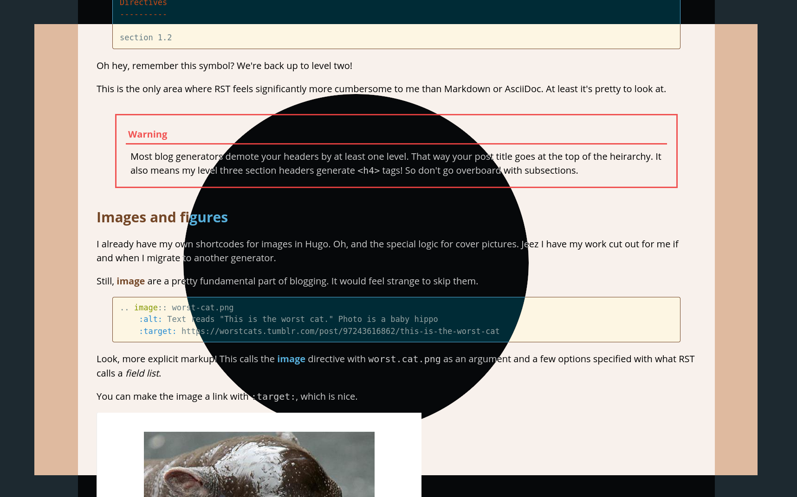

---
aliases:
- /note/2020/33/added-dark-mode-for-the-site/
- /note/2020/02/added-dark-mode-for-the-site/
category: note
date: 2020-02-02 19:45:13-08:00
slug: added-dark-mode-for-the-site
syndication:
  mastodon: https://hackers.town/@randomgeek/103592944673211153
  twitter: https://twitter.com/brianwisti/status/1224182828969156608
tags:
- site
- css
title: Added dark mode for the site
---

Got tired of blowing my eyeballs out during evening work.



How? I used [prefers-color-scheme](https://developer.mozilla.org/en-US/search?q=prefers-color-scheme). It tries to respect existing light/dark mode settings. Here’s the stylesheet short version.

````scss
:root {
  --text-color:                 hsl(0, 0%, 0%);
  --content-background-color:   hsla(0, 0%, 100%, 0.8);
}

@media (prefers-color-scheme: dark) {
  :root {
    --text-color:               hsl(0, 0%, 100%);
    --content-background-color: hsla(0, 0%, 0%, 0.8);
  }
}

#page-content {
   background-color: var(--content-background-color)
   color:            var(--text-color);
}
````
