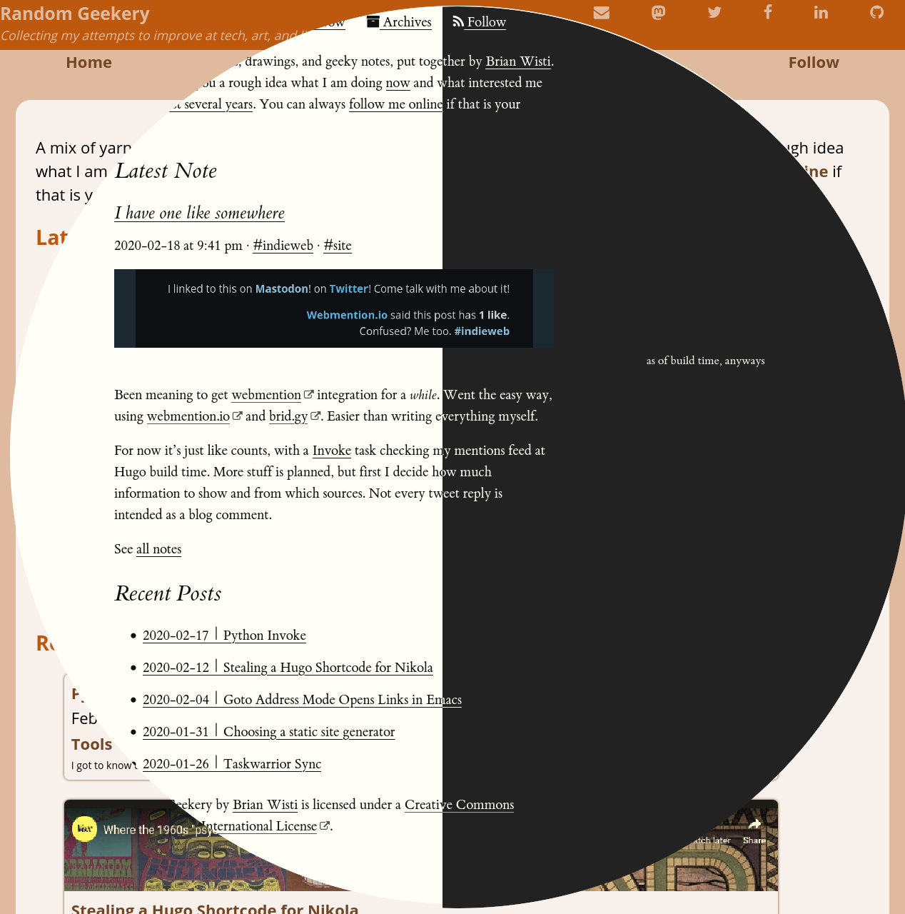

---
aliases:
- /2020/02/23/sort-of-tufte-css/
- /post/2020/02/sort-of-tufte-css/
category: post
date: 2020-02-23 00:02:03-08:00
description: I tried something new with my site style.
slug: sort-of-tufte-css
tags:
- css
- site
- tools
title: Sort of Tufte CSS
created: 2024-01-15T15:26:28-08:00
updated: 2024-01-26T11:03:26-08:00
---



Thought I’d try something new and bumped into [Tufte CSS](https://edwardtufte.github.io/tufte-css/). That’s a CSS stylesheet and font set aspiring to the style of Edward Tufte. He wrote the [The Visual Display of Quantitative Information](https://www.edwardtufte.com/tufte/books_vdqi).

Of course, I had to adjust the original CSS for my own quirks. Added more [Fork Awesome](https://forkaweso.me/) icons. Made the [reStructuredText](../../../card/reStructuredText.md) elements fit. Tips from a [David Walsh post](https://davidwalsh.name/external-links-css) helped me show external links.

One of the main goals was to get my site readable on mobile devices. Alas, Web design is not my strongest skill.

I’ll let you know if I figure out what my strongest skill *is*.

And I must say, this is the simplest highlighting theme I ever made:

````scss
.code {
    line-height: 1.6;

    .builtin {
        font-weight: bold;
    }

    .comment {
        color: var(--accent-color);
        font-style: italic;
    }

    .keyword {
        font-weight: bold;
    }

    .output {
        color: var(--accent-color);
    }
}
````

It doesn’t highlight much. Heck it didn’t highlight *anything* in that [SCSS](https://sass-lang.com/). Here. Try this:

````console
$ echo "Hello world" # a small demonstration
Hello world
````

But I’m not sure how long I’ll keep this style. For one thing, some of the bits like footnotes aren’t *quite* used as the stylesheet recommends. Though I could probably make it work across the site with some shortcodes. And there’s an awful lot of `float` and `clear` to get those side notes working. That can be a brittle approach.

Besides, I’ve been itching to play with [Tailwind CSS](https://tailwindcss.com/). I might even see if I can reimplement this theme with Tailwind. Except with more color.
