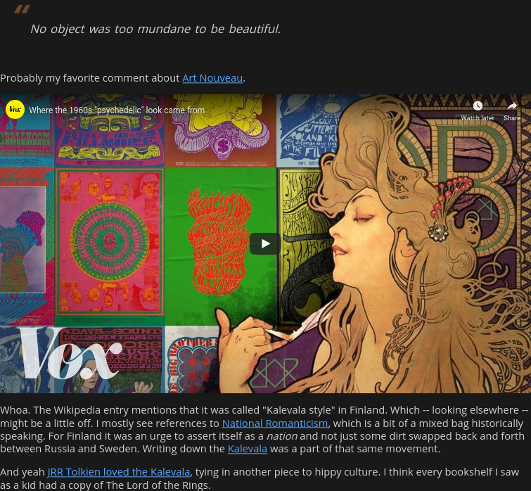

---
aliases:
- /2020/02/12/stealing-a-hugo-shortcode-for-nikola/
category: post
created: 2024-01-15 15:26:30-08:00
date: 2020-02-12 20:39:43-08:00
description: I needed a YouTube shortcode for Nikola, so I adapted Hugo's.
slug: stealing-a-hugo-shortcode-for-nikola
tags:
- nikola
- site
- hugo
- tools
title: Stealing a Hugo Shortcode for Nikola
updated: 2024-02-01 20:55:55-08:00
---



I keep waffling on whether to switch from \[Hugo\]\[hugo\] to \[Nikola\]\[nikola\] or some other [Static Site Generator](../../../card/Static%20Site%20Generator.md). Meanwhile, my Nikola import spare time project continues. Got the basic structure down, and my theme is almost useful. It even improved the Hugo version of the site.

 > 
 > **NOTE**
>
 > `nikola check -l` looks for broken internal links on your build output. It found a few in the imported files. I fixed them.
 > 
 > And yes. I wrote a [post/2017/04/making-a-mojo-link-checker](../../2017/04/making-a-mojo-link-checker.md) in 2017. No, I haven’t used it since.

## The shortcode

Some posts included embedded YouTube videos. Nikola’s [RST extensions](https://getnikola.com/handbook.html#restructuredtext-extensions) include a [youtube directive](https://getnikola.com/handbook.html#youtube), but I needed something for the Markdown files. Well, okay. `media` from the [built-in shortcodes](https://getnikola.com/handbook.html#built-in-shortcodes) would work. I wanted to make a template shortcode, okay?

Here’s what the [Hugo shortcode](https://github.com/gohugoio/hugo/blob/00297085db48cbb7949c9867012f6df38817fc29/tpl/tplimpl/embedded/templates/shortcodes/youtube.html) looks like.

````text
{{- $pc := .Page.Site.Config.Privacy.YouTube -}}
{{- if not $pc.Disable -}}
{{- $ytHost := cond $pc.PrivacyEnhanced  "www.youtube-nocookie.com" "www.youtube.com" -}}
{{- $id := .Get "id" | default (.Get 0) -}}
{{- $class := .Get "class" | default (.Get 1) }}
<div {{ with $class }}class="{{ . }}"{{ else }}style="position: relative; padding-bottom: 56.25%; height: 0; overflow: hidden;"{{ end }}>
    <iframe src="https://{{ $ytHost }}/embed/{{ $id }}{{ with .Get "autoplay" }}{{ if eq . "true" }}?autoplay=1{{ end }}{{ end }}" {{ if not $class }}style="position: absolute; top: 0; left: 0; width: 100%; height: 100%; border:0;" {{ end }}allowfullscreen title="YouTube Video"></iframe>
</div>
{{ end -}}
````

I never knew about YouTube privacy configuration for the shortcode. Ah. That’s because it’s not in the [shortcode documentation](https://gohugo.io/content-management/shortcodes/#youtube). I like it though. I think I’ll use it.

 > 
 > **NOTE**
>
 > Ah. It’s documented in [Hugo and the GDPR](https://gohugo.io/about/hugo-and-gdpr/).

If you want a Nikola configuration available to your shortcode, add it to ``conf.py’s `GLOBAL_CONTEXT`` dictionary.

````python
# Put in global_context things you want available on all your templates.
# It can be anything, data, functions, modules, etc.
GLOBAL_CONTEXT = {
    "youtube_privacy_enhanced": True,
}
````

And here’s `shortcodes/youtube.tmpl`, adapted for Mako.

````mako{title="shortcodes/youtube.tmpl"}
<%
    id = _args[0]
    root_url = "www.youtube-nocookie.com" if youtube_privacy_enhanced else "www.youtube.com"
    embed_url = f"https://{root_url}/embed/{id}"
    style_in_page = "position: relative; padding-bottom: 56.25%; height: 0; overflow: hidden;"
    player_style = "position: absolute; top: 0; left: 0; width: 100%; height: 100%; border:0;"
%>
<div style="${style_in_page}">
    <iframe src="${embed_url}"
        style="${player_style}"
        allowfullscreen title="YouTube Video"></iframe>
</div>
````

Not much needed here. It takes the YouTube ID as an argument, picks a host based on `youtube_privacy_enhanced`, and adds some HTML.


It works!

## What Now?

I’m not sure. The Nikola experiment is fun, but I have ideas for the Hugo flow too.