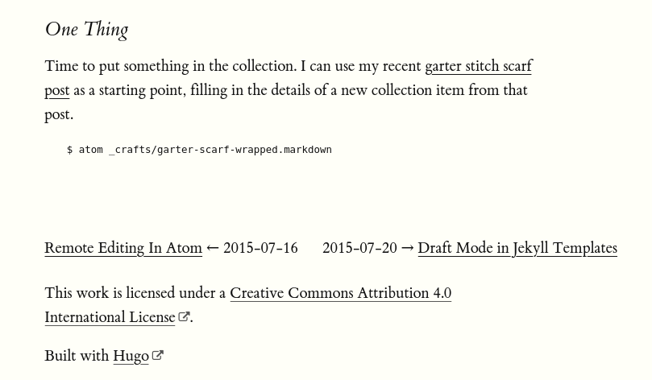

---
aliases:
- /note/2020/56/that-is-just-embarrassing/
- /note/2020/02/that-is-just-embarrassing/
category: note
created: 2024-01-15 15:26:28-08:00
date: 2020-02-25 21:41:36-08:00
slug: that-is-just-embarrassing
syndication:
  mastodon: https://hackers.town/@randomgeek/103723600431654059
  twitter: https://twitter.com/brianwisti/status/1232545330216013825
tags:
- site
- oops
- i-fixed-it
title: That Is Just Embarrassing
updated: 2024-02-02 10:04:20-08:00
---

Where's the rest of the post?

Got a [Pyinvoke](../../../card/Pyinvoke.md) `test` task for the site. Because of that, I found a post about [Jekyll collections](../../2015/07/making-a-jekyll-collection.md) that got truncated — before the current repo existed.

Fixed it though. Got the missing content from an [old copy](https://web.archive.org/web/20160318224730/http://randomgeekery.org/post/2015/making-a-jekyll-collection). Yay for Internet Archive!