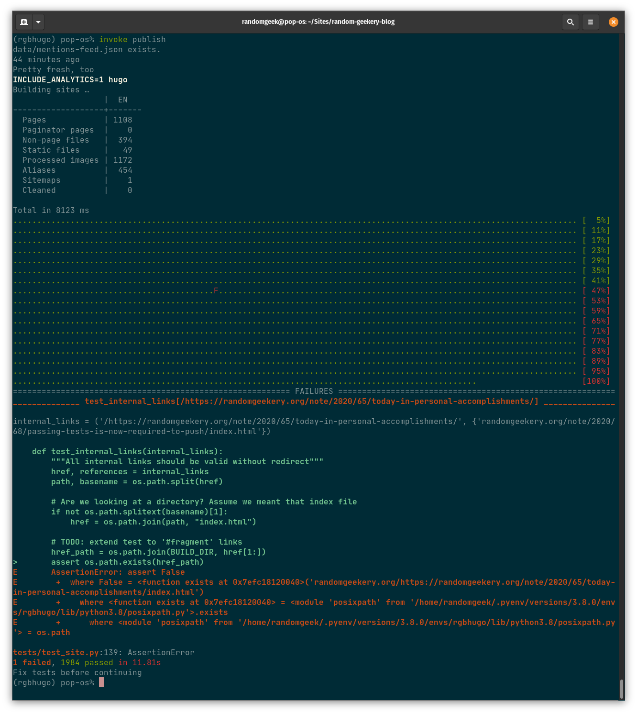

---
aliases:
- /note/2020/68/passing-tests-is-now-required-to-push/
- /note/2020/03/passing-tests-is-now-required-to-push/
category: note
created: 2024-01-15 15:26:30-08:00
date: 2020-03-08 23:50:55-07:00
slug: passing-tests-is-now-required-to-push
syndication:
  mastodon: https://hackers.town/@randomgeek/103791810073034057
  twitter: https://twitter.com/brianwisti/status/1236910866769076225
tags:
- site
title: Passing Tests Is Now Required to Push
updated: 2024-02-02 09:54:42-08:00
---

A failing test

Push the site, that is.

Building on work from [today-in-personal-accomplishments](today-in-personal-accomplishments.md). Course, I don’t know what test coverage is. I know it ain’t 100% of what I want to check.