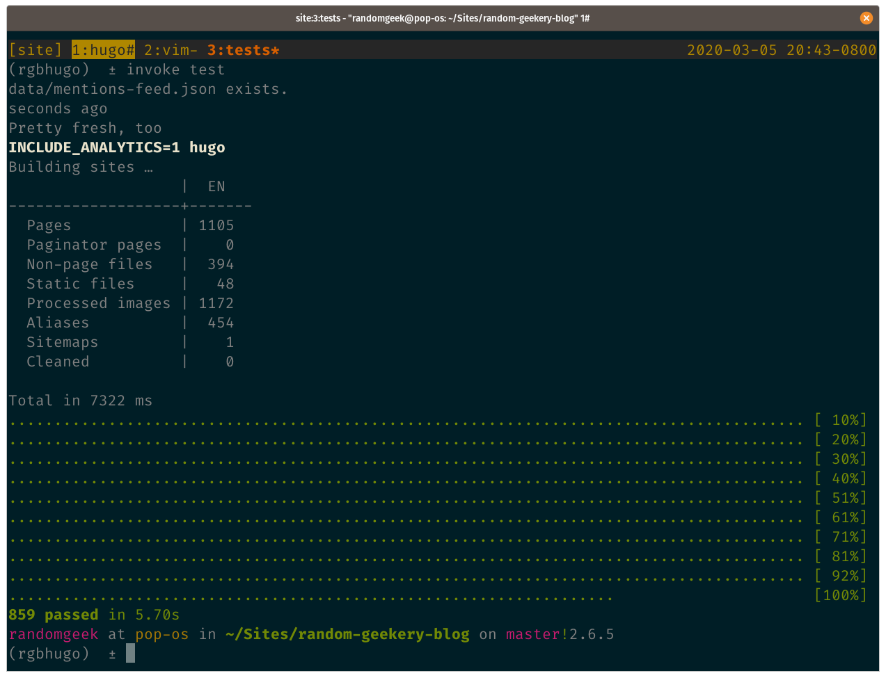

---
aliases:
- /note/2020/65/today-in-personal-accomplishments/
- /note/2020/03/today-in-personal-accomplishments/
category: note
created: 2024-01-15 15:26:30-08:00
date: 2020-03-05 20:23:19-08:00
slug: today-in-personal-accomplishments
syndication:
  mastodon: https://hackers.town/@randomgeek/103774313023211236
  twitter: https://twitter.com/brianwisti/status/1235790515356004352
tags:
- site
title: Today in Personal Accomplishments
updated: 2024-02-01 21:01:52-08:00
---

Been doing quality assurance on my site. Need to know what I got before any more big changes. Yes, 7.3 seconds is slow for [Hugo](../../../card/Hugo.md). It’s all the [reStructuredText](../../../card/reStructuredText.md). No plan to change *that*.