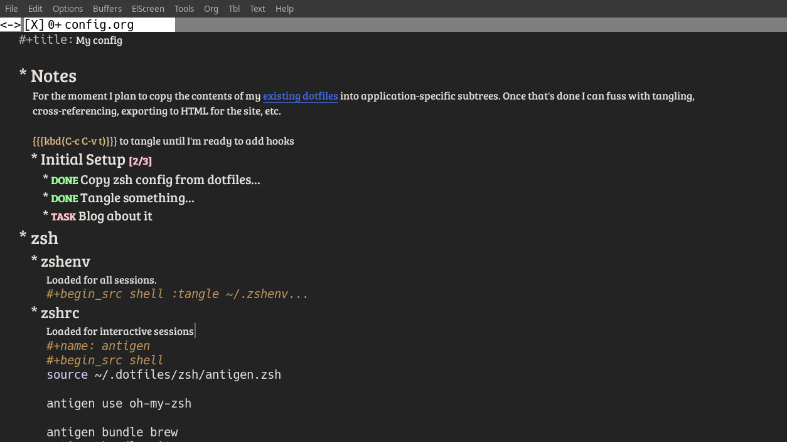

---
aliases:
- /2020/04/28/from-dotfiles-to-org-file/
category: post
created: 2024-01-15 15:26:27-08:00
date: 2020-04-28 01:36:54-07:00
description: at 1:30am they're all good ideas
slug: from-dotfiles-to-org-file
syndication:
  mastodon: https://hackers.town/@randomgeek/104075340897518607
  twitter: https://twitter.com/brianwisti/status/1255056188087111681
tags:
- emacs
- shell
- orgmode
- orgconfig
- tools
title: From Dotfiles to Org File
updated: '2024-01-26T11:02:28'
---



I read [Literate Configuration](https://leanpub.com/lit-config/) by [Diego Zamboni](https://zzamboni.org/). Now I want to replace my [Dotbot](https://github.com/anishathalye/dotbot)-managed dotfiles with an [card/Org](../../../card/Org.md) file.

# Literate Configuration?

Literate configuration comes out of [literate programming](http://literateprogramming.com/index.html), which mixes code and text about the code in a single document. Okay yes. Like code comments. Where literate programming gets more interesting than comments is how it "tangles" snippets together, creating files out of these code snippets you’ve described. It’ll be a little easier to understand when you try it. But you can describe the reasoning behind your code or look at your code as high level components.

Folks still argue whether literate programming is a useful approach to software development. But it could be a good way to handle config files. Personal configuration tends to collect disparate elements with little organization. Weaving them together in a single document could help create a coherent story of how you use your systems.

Diego Zamboni’s booklet includes 17 pages of instruction and 80 pages of sample config for Emacs, the [Hammerspoon](https://www.hammerspoon.org/) macOS automation tool, and the [Elvish](https://elv.sh/) shell, all of which you can also find [on his blog](https://zzamboni.org/post/2017-12-17-my-emacs-configuration-with-commentary/). I have no regrets about spending $5 on *Literate Configuration*. The
formatting is better, for one thing.

# Dotfiles?

An informal reference to one person’s collection of configurations and settings. They’re named for the common Unix convention of using a leading dot in config filenames: `.zshrc`, for example. Many folks, including me, like to keep those dotfiles in version control. Makes it easier to track changes or roll back when something doesn’t work like you thought it would. Also simplifies setting up new machines.

You can find a nice introductory site for the version-controlled dotfiles approach on [Github](https://dotfiles.github.io/).

# In an Org file?

Well of course. What did you think I was going to use — [Markdown](https://github.com/jostylr/literate-programming)? [reStructuredText](https://slott56.github.io/PyLit-3/_build/html/index.html)? [Asciidoctor](https://aimlesslygoingforward.com/blog/2019/10/02/roguelike-tutorial-up-to-date-and-literate/)?

Actually those are pretty cool. I could maybe work up an extension for more pleasing notation, and — no! I already started this with Org mode. I can finish this with Org mode.

Maybe later, Asciidoctor.

Yeah, Org. [Babel](https://orgmode.org/worg/org-contrib/babel/) lets Org execute and/or [extract](https://orgmode.org/manual/Extracting-Source-Code.html#Extracting-Source-Code) source code. It supports a long list of [languages](https://orgmode.org/worg/org-contrib/babel/languages.html). I don’t need to find or write extensions for basic functionality.

# Prepare Org mode

Babel used to be an extension to Org, but it’s been a core part of the framework for a bit now. Thing is, Babel is powerful and a little dangerous. You need to give it permission.

**`~/.emacs`**

````elisp
(use-package org
  :ensure org-plus-contrib
  :defer t
  :custom
  (org-confirm-babel-evaluate nil)
  ; ...
  :config
  (org-babel-do-load-languages
   'org-babel-load-languages
   '((shell . t)))) 
````

* `shell` is a general-purpose mode that covers `sh`, `bash`, `zsh`, and so on.

Babel wants to know what languages it can load. I’m only tangling shell files, so that’s all I put in `org-babel-load-languages`.

By default, Babel requests confirmation from you for every code block it handles. That’s smart, but also annoying. Disabling `org-confirm-babel-evaluate` means I’m okay with Babel executing or extracting any code it finds. It also means I need to ensure that my code blocks don’t request any dangerous actions. Leave this setting enabled if smart matters more to you than annoying.

 > 
 > **Correction**
>
 > The Babel settings I added are for code *extraction*, not code evaluation. Babel extracts anything you want. [Code evaluation](https://orgmode.org/manual/Evaluating-Code-Blocks.html#Evaluating-Code-Blocks) is a different feature, and not needed for this post. Skip my `:custom` and `:config` items if you’re just tangling.

Zamboni’s booklet provides directions for automatic export on save, but I’m still new to this. I’ll stick with manually triggering extraction for now.

# My literate config

Let’s keep my starting point really really simple. Just a little bit out of my [Zsh](https://www.zsh.org/) config.

**`config.org`**

````org
#+title: My config

* Notes
{{{kbd(C-c C-v t)}}} to tangle until I'm ready to add hooks

* zsh

** zshenv

Loaded for all sessions.

#+begin_src shell :tangle ~/.zshenv
EDITOR="vim"
#+end_src

** zshrc

Loaded for interactive sessions

#+begin_src shell :tangle ~/.zshrc
source ~/.config/broot/launcher/bash/br
#+end_src
````

Then I hit `C-c C-v t` to run `org-babel-tangle`, which tells me:

````
Tangled 2 code blocks from config.org
````

So I look in my files.

**`~/.zshenv`**

````zsh
EDITOR="vim"
````

**`~/.zshrc`**

````zsh
source ~/.config/broot/launcher/bash/br
````

Yay it worked!

There’s not much being "tangled" though, is there?

I’ve been playing with [Antigen](https://antigen.sharats.me/), but I may go back to [Oh My Zsh](https://ohmyz.sh/). Let’s put the Antigen stuff in its own block.

````org
#+name: antigen
#+begin_src shell
source ~/.dotfiles/zsh/antigen.zsh

antigen use oh-my-zsh

antigen bundle git
antigen bundle nvm
antigen bundle pyenv
antigen bundle rbenv
antigen bundle taskwarrior
antigen bundle tmux

antigen bundle zsh-users/zsh-syntax-highlighting
antigen theme gozilla

antigen apply
#+end_src
````

Now we update the `~/.zshrc` block to tangle with `:noweb yes` and include that new block.

````org
#+begin_src shell :tangle ~/.zshrc :noweb yes
<<antigen>>

source /home/random/.config/broot/launcher/bash/br
#+end_src
````

C-c C-v t again, and there it is!

**`~/.zshrc`**

````zsh
source ~/.dotfiles/zsh/antigen.zsh

antigen use oh-my-zsh

antigen bundle brew
antigen bundle git
antigen bundle nvm
antigen bundle pyenv
antigen bundle rbenv
antigen bundle taskwarrior
antigen bundle tmux

antigen bundle zsh-users/zsh-syntax-highlighting
antigen theme gozilla

antigen apply

source /home/random/.config/broot/launcher/bash/br
````

Okay now to finish getting the rest of my zsh config. Oh, and put `config.org` in version control.

**Emacs code extraction key bindings**

|Key|Function|Action|
|---|--------|------|
|`C-c C-v t`|`org-babel-tangle`|Extract and write code blocks in the current Org file|