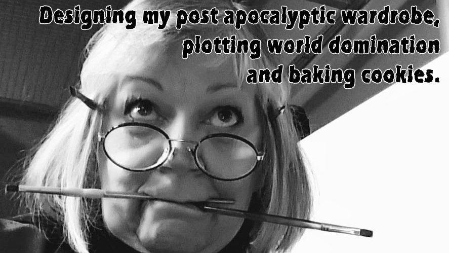

---
aliases:
- /note/2020/111/how-mom-stays-creative/
- /note/2020/04/how-mom-stays-creative/
category: note
created: 2024-01-15 15:26:26-08:00
date: 2020-04-20 21:20:00-07:00
slug: how-mom-stays-creative
syndication:
  mastodon: https://hackers.town/@randomgeek/104034687115829606
  twitter: https://twitter.com/brianwisti/status/1252454678991945728
tags:
- life
- art
- mom
- bad-image-captions
title: How Mom stays creative
updated: 2024-01-26 11:02:46-08:00
---

My mom, and her plans

[NOTO](https://explorenoto.org/) — the North Topeka Arts & Entertainment District — asked several artists a question in a [Facebook post](https://www.facebook.com/explorenoto/photos/a.111376888892182/3355542067808965/?type=3&theater):

 > 
 > What are you doing to stay creative during the COVID-19 outbreak?

My mom — subliminal message: [BUY HER ART](https://www.shellybedsaul.com/) — gave the best [answer](https://www.facebook.com/explorenoto/photos/a.111376888892182/3355542067808965/?type=3&theater):

 > 
 > Designing my post apocalyptic wardrobe, plotting world domination and baking
 > cookies.