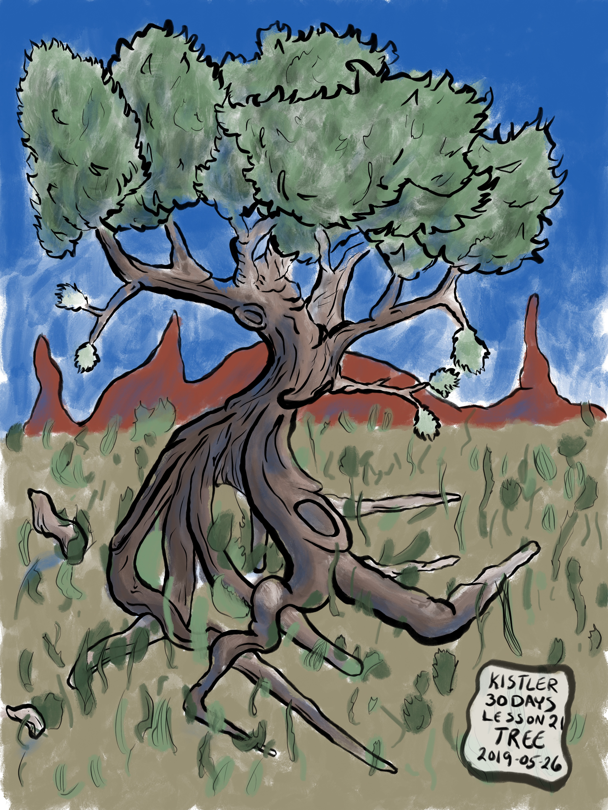

---
aliases:
- /note/2020/109/kistler-tree/
- /note/2020/04/kistler-tree/
category: note
date: 2020-04-18 20:25:00-07:00
slug: kistler-tree
syndication:
  mastodon: https://hackers.town/@randomgeek/104023170828376600
  twitter: https://twitter.com/brianwisti/status/1251717527388008448
tags:
- drawing
- procreate
- art-attack
title: Kistler Tree
---

Found this in my image folder the other day. It’s from working through [Mark Kistler](https://markkistler.com/)'s book *You can Draw in 30 Days* last year. I like it. Sure I kinda already know I can draw. But it’s good to refresh yourself every so often.

Tree

Oh, and I used [Max Ulichney](https://maxulichney.com/)'s [MaxPack](https://gumroad.com/maxulichney) brush sets for[Procreate](https://procreate.art/). The Gouache pack for sure, and probably others.
