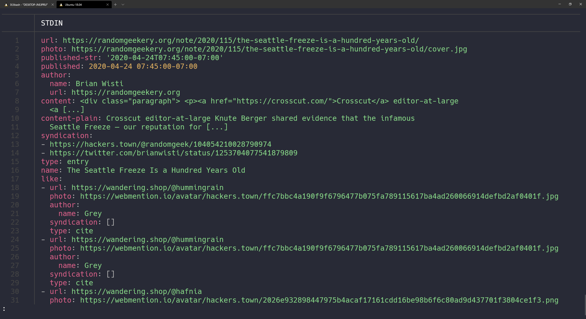

---
aliases:
- /note/2020/117/patronize-me-on-liberapay/
- /note/2020/04/patronize-me-on-liberapay/
category: note
date: 2020-04-26 21:15:00-07:00
slug: patronize-me-on-liberapay
syndication:
  mastodon: https://hackers.town/@randomgeek/104068641669767131
  twitter: https://twitter.com/brianwisti/status/1254627759659376641
tags:
- personal
- site
- money
- filthy-lucre
title: Patronize Me on Liberapay
updated: 2020-04-27 07:00:00-07:00
---

Been skimming through [ethical.net](https://ethical.net) resources recently. [Liberapay](https://en.liberapay.com/) looks interesting: a patronage system like Patreon, but without reward tiers. More of a "keep doing — whatever the hell it is that you’re doing — it’s great" approach. So I [joined](https://en.liberapay.com/randomgeek/) of course. Give me money and I’ll keep doing exactly what I’ve been doing. Such a deal!
