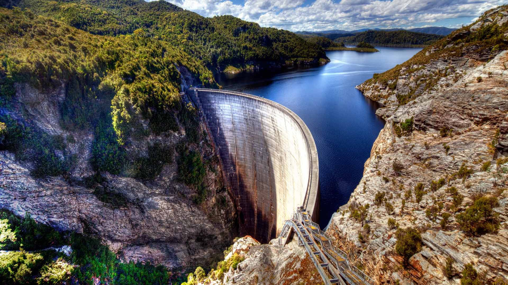

---
aliases:
- /note/2020/04/sorry-if-i-broke-your-rss-feed/
category: note
created: 2024-01-15 15:26:27-08:00
date: 2020-04-30 23:30:00-07:00
slug: sorry-if-i-broke-your-rss-feed
syndication:
  mastodon: https://hackers.town/@randomgeek/104091857621659423
  twitter: https://twitter.com/brianwisti/status/1256113578995847173
tags:
- site
- i-fixed-it
- damstack
- did-i-make-a-buzzword-yet
title: Sorry if I Broke Your Rss Feed
updated: 2024-01-26 11:02:58-08:00
---

Gordon Dam, by Dante Aguiar. Via [Good Free Photos](https://www.goodfreephotos.com/other-landscapes/gordon-dam-and-beautiful-landscape.jpg.php)

But hey I got my permalinks where I wanted them, without needing a UUID after all. Took a bit of juggling to get the Hugo [aliases](https://gohugo.io/content-management/urls/#aliases) and my support data synced up. You folks got the [Jamstack](https://jamstack.org) — JavaScript, APIs, Markup — for your static sites. I got — uh, guess I got the "Damstack" — Database, APIs, Markup — for *my* static site.

Blame [fREW](https://blog.afoolishmanifesto.com/posts/hugo-unix-vim-integration/#advanced-unix-tools). For the idea. Not the terrible name. That’s all me, friends.