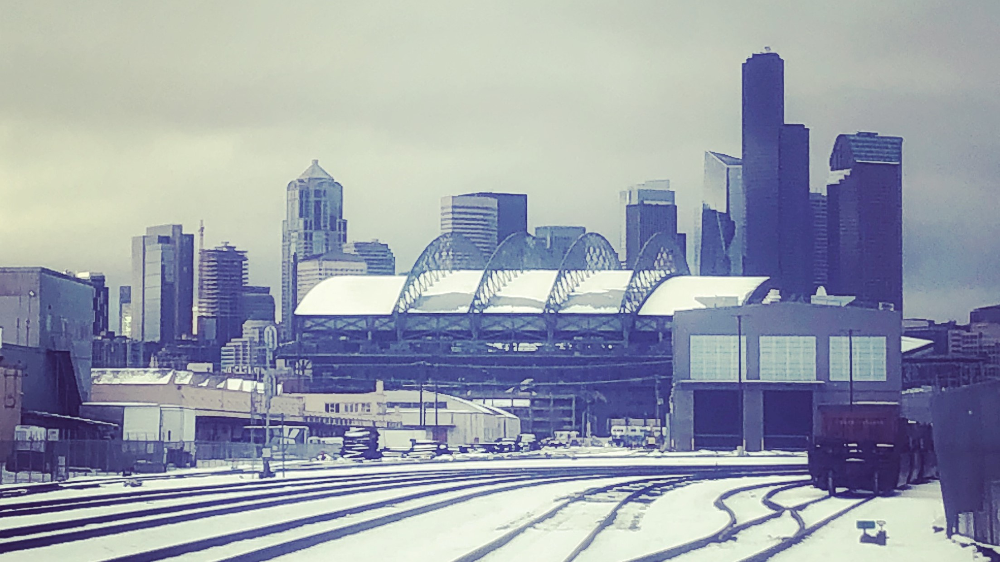

---
aliases:
- /note/2020/115/the-seattle-freeze-is-a-hundred-years-old/
category: note
date: 2020-04-24 07:45:00-07:00
slug: the-seattle-freeze-is-a-hundred-years-old
syndication:
  mastodon: https://hackers.town/@randomgeek/104054210028790974
  twitter: https://twitter.com/brianwisti/status/1253704077541879809
tags:
- seattle
- history
title: The Seattle Freeze Is a Hundred Years Old
updated: 2020-04-26 11:40:00-07:00
---

Sometimes there's a literal freeze

[Crosscut](https://crosscut.com/) editor-at-large [Knute Berger](https://crosscut.com/author/knute-berger) shared evidence that the infamous [Seattle Freeze](https://www.seattletimes.com/life/lifestyle/seattle-freeze-forget-making-friends-half-of-washington-residents-dont-even-want-to-talk-to-you/) — our reputation for keeping everyone at arm’s length — has been with us for a while.

[The first known evidence of the Seattle Freeze](https://crosscut.com/2020/04/first-known-evidence-seattle-freeze):

 > 
 > …while researching the pandemic of 1918-1920, Ben Helle, the ever-sharp-eyed archivist at the Washington State Archives, came across a Seattle Times clipping that suggested conversation about Seattle’s frigid nature as far back as the spring of 1920.

It can be frustrating, but the Freeze has its [good points](https://www.thrillist.com/lifestyle/seattle/how-i-learned-to-love-the-seattle-freeze).  Less pressure for small talk and social obligations. Plus when we’ve decided we like you, you can’t get rid of us.
