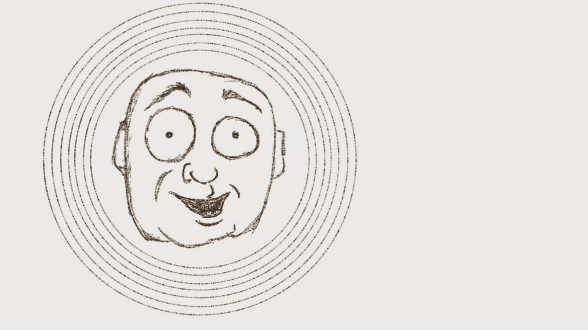

---
aliases:
- /note/2020/113/why-do-i-blog/
- /note/2020/04/why-do-i-blog/
category: note
date: 2020-04-22 13:00:00-07:00
slug: why-do-i-blog
syndication:
  mastodon: https://hackers.town/@randomgeek/104044038344776759
  twitter: https://twitter.com/brianwisti/status/1253052771793846273
tags:
- why
- blog
- drawing
- reply
- but-not-a-proper-indieweb-reply
- sorry
title: Why Do I Blog?
created: 2024-01-15T15:26:30-08:00
updated: 2024-01-26T11:03:03-08:00
---

searched my image library for "why" and got this old doodle

[Kev Quirk](https://kevq.uk/why-i-have-a-blog) asks:

 > 
 > Why do you blog?
 > 
 > -- <cite>\[Why I Have A Blog\]\[\]</cite>

I usually answer *Why are you like that* questions — which I get asked with some frequency, for good or ill — with "I can’t help it. It’s in my nature." The constant puttering, interspersed with oversharing that ranges from instructive to awkward? That’s just me. I wouldn’t be me if I didn’t do that.

But this came across my RSS feed, and it works too.

Austin Kleon, [Do what you know how to do](https://austinkleon.com/2020/04/19/do-what-you-know-how-to-do/):

 > 
 > “It seems stupid I would put out an album,” says Fiona Apple, of her terrific
 > new record, Fetch the Bolt Cutters. “But this is what I know how to do.”
 > 
 > I love that: “This is what I know how to do.”

That’s true too. There are ways to putter and rant besides blogging. I could have a YouTube channel. But this is what I know how to do.

Thank goodness.
