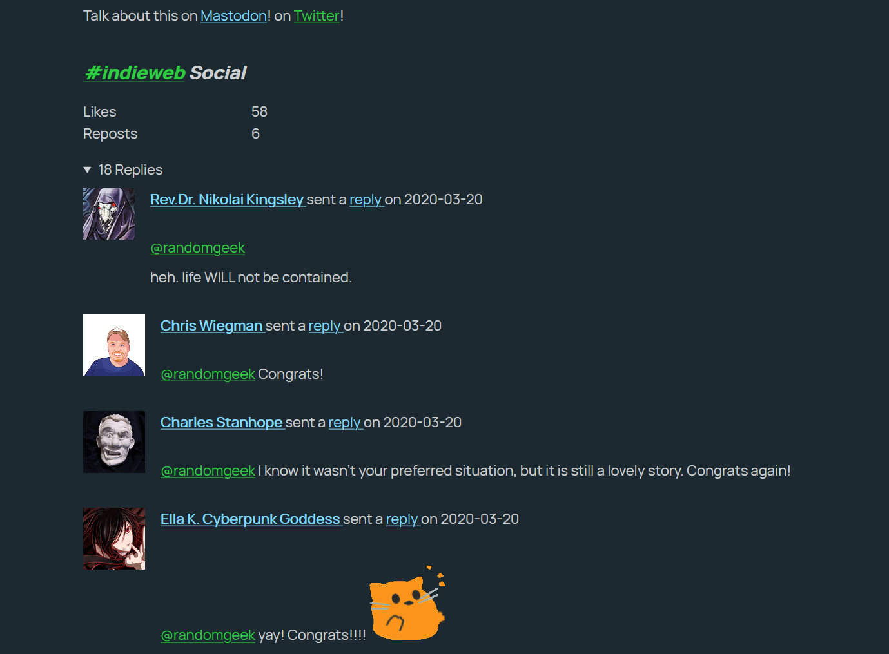

---
aliases:
- /note/2020/94/yay-i-added-mentions-and-replies/
- /note/2020/04/yay-i-added-mentions-and-replies/
category: note
date: 2020-04-03 00:18:00-07:00
slug: yay-i-added-mentions-and-replies
syndication:
  mastodon: https://hackers.town/@randomgeek/103933433416503565
  twitter: https://twitter.com/brianwisti/status/1245974320272347137
tags:
- indieweb
- site
title: Yay I Added Mentions and Replies
created: 2024-01-15T15:26:33-08:00
updated: 2024-01-26T11:03:05-08:00
---

Not real time, of course. It updates when I build the site. The layout needs touching up. But all the details are there.

Webmentions for [my wedding post](../03/got-married-yesterday.md)

I used Max Böck’s [Webmentions post](https://mxb.dev/blog/using-webmentions-on-static-sites/#webmentions) as a starting point.

And yes, I’m far enough along with the [IndieWeb](../../../card/IndieWeb.md) stuff that my study notes would make a decent blog post. Maybe a couple.
