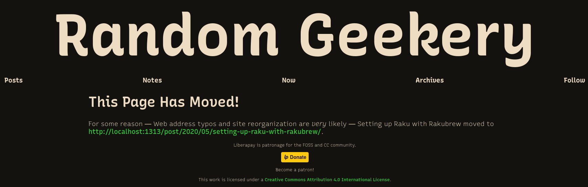

---
aliases:
- /post/2020/05/alias-templates-in-hugo/
category: post
created: 2024-01-15 15:26:27-08:00
date: 2020-05-20 15:15:00-07:00
description: I killed some redirects for accessibility and likes
slug: alias-templates-in-hugo
syndication:
  mastodon: https://hackers.town/@randomgeek/104203115715792019
  twitter: https://twitter.com/brianwisti/status/1263234062841516033
tags:
- hugo
- accessibility
- indieweb
- i-fixed-it
- hopefully
- site
- tools
title: Alias Templates in Hugo
updated: 2024-02-01 15:45:51-08:00
---


It's not a redirect anymore

 > 
 > \[!WARNING\] Don't do this
 > This was an interesting experiment, but messed with results on search engine pages. Nothing but "This Page Has Moved!" as far as the eye can see after a few months.
 > 
 > Use regular [card/Hugo](../../../card/Hugo.md) alias frontmatter and leave it at that.

Yesterday I [wrote](setting-up-raku-with-rakubrew.md) about using [rakubrew](https://rakubrew.org/), a tool for managing installations of the [card/Raku](../../../card/Raku.md) programming language.  It’s an okay post.  I liked my little shoutout to [Jeff Goff](https://web.archive.org/web/20200212094016/http://theperlfisher.com/).  Those who knew him better shared [better words](https://wendyga.wordpress.com/2020/04/06/jeff-goff-thanks-for-being-a-friend/).

Anyways — the post!  People responded on Twitter and Mastodon.  It was great.

Except none of those responses show up in the "IndieWeb Reactions" section of the post here on the site.

## A problem

I know why — basically.

My post title and URL referenced Rakubrew’s predecessor "Rakudobrew," which I considered an unacceptable faux pas.  So I fixed it.

## Hugo aliases: A solution to for my URL typo

This faux pas was easily corrected with [Hugo Aliases](https://gohugo.io/content-management/urls/#aliases).  Move your content where it needs to be, and add an alias for the old link to content front matter.

````yaml{title="Front matter for my Rakubrew post" verbatim=false}
title: Setting up Raku with Rakubrew
stub: setting-up-raku-with-rakubrew
⋮
aliases:
- /post/2020/05/setting-up-raku-with-rakudobrew/
````

With default configuration, Hugo generates an HTML redirect page for every alias.

````html{title="HTML generated by Hugo for the alias" verbatim=false}
<!DOCTYPE html>
<html>
<head>
  <title>https://randomgeekery.org/post/2020/05/setting-up-raku-with-rakubrew/</title>
  <link rel="canonical" href="https://randomgeekery.org/post/2020/05/setting-up-raku-with-rakubrew/"/>
  <meta name="robots" content="noindex">
  <meta charset="utf-8" />
  <meta http-equiv="refresh" content="0; url=https://randomgeekery.org/post/2020/05/setting-up-raku-with-rakubrew/" />
  </head>
</html>
````

The visitor may briefly see a blank page.  Browsers visiting the old URL see the `http-equiv="refresh"` element and immediately go to the new `url`. Normally, this is fine.

## Now for today’s problem

Now my *inbox/Webmention* feed is busted.  The syndication links all point to the old URL.  Visitors get corrected, but Webmention senders don’t.  [Brid.gy](https://brid.gy/) — a lovely service which forwards social network reactions to your webmention handler — saw nothing to forward to!


Well of *course* there’s no Webmention support.  The generated alias files have no `link rel="webmention"`!

Took me a solid hour to figure that one out.

## Use a custom alias template for my webmention problem

Oh thank goodness. Hugo supports [custom alias templates](https://gohugo.io/content-management/urls/#customize).

What’s the least I can do to get things working?

````html{title="layouts/alias.html"}
<!DOCTYPE html>
<html>
  <head>
    <title>{{ .Permalink }}</title>
    <link rel="canonical" href="{{ .Permalink }}">
    <link rel="webmention" href="https://webmention.io/randomgeekery.org/webmention"/>
    <link rel="pingback" href="https://webmention.io/randomgeekery.org/xmlrpc"/>
    <meta name="robots" content="noindex">
    <meta charset="utf-8" />
    <meta http-equiv="refresh" content="0; url={{ .Permalink }}" />
  </head>
</html>
````

 > 
 > **NOTE**
>
 > I was going to do a whole post on receiving webmentions, but that’s basically it  right there. Sign up at [Webmention.io](https://webmention.io) and add the `<link>` to your pages.

Brid.gy now sees the webmention link at the old URL.  I can manually resend the relevant mentions.  All is well.

Almost.  Now that I’m looking at my templates, I see problems.

## This afternoon’s problem: accessibility

Non-essential page refreshes cause accessibility issues.  Visitors may not have enough time to read the page before it redirects them.  And what if the refresh doesn’t happen, either due to user preference or browser bug?  The blank page offers no clue as to what they should expect.

So I go read the [Web Content Accessibility Guidelines](https://www.w3.org/TR/WCAG21/).  Okay I skimmed it. We already know there’s plenty more I could be doing for accessibility.  No need to get overwhelmed.

Oh heck — the WCAG figures client-side page refreshes should be treated as [deprecated](https://www.w3.org/TR/WCAG10-CORE-TECHS/#auto-page-refresh).

 > 
 > Until user agents provide the ability to stop auto-redirect, do not use markup to redirect pages automatically.  Instead, configure the server to perform redirects.

I tried that, and it still caused confusion about webmentions.  Services out there expect to interact with the link they have, and they don’t all understand redirect.  I don’t have to like it, but I should acknowledge it.

They list specific tests for client-side page refreshes.  I could compare what I have to the list.

 > 
 > For a page that uses `meta http-equiv="refresh"`:
 > 
 > 1. Check that the numerical value for seconds until refresh in the content attribute is present.
 > 1. Check that the numerical value for seconds until refresh in the content attribute is less than one or greater than 72,000.
 > 1. Check if the page qualifies for Real-time or Essential Exceptions in Success Criterion 2.2.1 Timing Adjustable.
 > 1. Check if the user is provided an opportunity to turn off, extend, or adjust the timing of the page refresh.
 > 1. Check if the page does not refresh after the duration specified in the content attribute.

— WCAG21, [Failure of Success Criterion 2.2.1, 2.2.4, and 3.2.5 due to using meta refresh to reload the page](https://www.w3.org/WAI/WCAG21/Techniques/failures/F41.html)

* There is a numerical value: `0`. Yay!
* zero is less than one. Yay!
* Nothing about my page requires real-time interaction, and while *I* may think   it’s [essential](https://www.w3.org/TR/WCAG21/#dfn-essential) to get you at the updated address, you could get the same   result if I give you a link.  Even more unnerving for me: you could *choose*   not to follow that link.
* How would I let a user control an automatic refresh?  Some Javascript maybe? Sure I want to add client-side functionality to the site, but I don’t want to start here.

"Ah," I hear you say.  "But your alias refreshes immediately. Besides, there’s no content to read!"

Right, I know.  I’m talking about what they call an "edge case." Most people are used to Web pages shifting and changing address underneath them.  We’re used to doing it to them, anyways.

And the more I think about it, the more that empty page bugs me.  We should tell folks if we’re sending them somewhere else.  We should give them the option of not going.

Maybe just "this page moved" and a link instead of an automatic refresh.  That works for now.

I have no problem with automatic redirect for non-entry content: sections, pagination, archives, tag listings, and so on.  I made peace with my constant puttering on those a long time ago.  [redirect in `.htaccess`](https://help.dreamhost.com/hc/en-us/articles/215747748-How-can-I-redirect-and-rewrite-my-URLs-with-an-htaccess-file-) suffices for non-entry content.  But actual posts and pages should stay constant or at the very least tell you where they went.

And this post adds a new rule that they need to tell *you* — not just the browser.

This is what I came up with, more or less.

````html{title="layouts/alias.html"}
<!DOCTYPE html>
<html>
  <head>
    <title>{{ .Permalink }}</title>
    <link rel="canonical" href="{{ .Permalink }}">
    <link rel="webmention" href="https://webmention.io/randomgeekery.org/webmention"/>
    <link rel="pingback" href="https://webmention.io/randomgeekery.org/xmlrpc"/>
    <meta name="robots" content="noindex">
    <meta charset="utf-8" />
    {{ if .Page }}
      {{- $includeAnalytics := getenv "INCLUDE_ANALYTICS" -}} <!-- 1 -->
      {{- if eq $includeAnalytics "1" -}}
        <script async defer data-domain="randomgeekery.org"
                            src="https://plausible.io/js/plausible.js"></script>
      {{- end -}}
    {{ else }}
      <meta http-equiv="refresh" content="0; url={{ .Permalink }}" />
    {{ end }}
  </head>
  <body>
    {{ with .Page }}
      <h1>This Page Has Moved!</h1>
      <p>
        For some reason — Web address typos and site reorganization are <em>very</em>
        likely — {{ .Page.Title }} moved to <a href="{{ .Permalink }}">{{ .Permalink }}</a>.
      </p>
    {{ else }} <!-- 2 -->
      {{/* reenable to hunt down pagination links <!-- 3 -->
        {{ warnf "No page defined for %q" .Permalink }}
      */}}
      <p>
        Hugo generated this redirect to <a href="{{ .Permalink }}">{{ .Permalink }}</a>
        automatically during site generation. Please follow the link if your browser
        does not immediately redirect.
      </p>
    {{ end }}
</html>
````

1. Analytics for aliased pages, because I want to know if folks are clicking on
   old links, but not for pagination aliases. Those are noise for me, not
   information.
1. Today I learned that [`with`](https://gohugo.io/functions/with/) supports `else`
1. When this [comment](https://gohugo.io/templates/introduction/#comments) is removed, Hugo will [warn](https://gohugo.io/functions/warnf/) me about aliases not associated with my content.

It works with some tweaking.  Hugo [pagination](https://gohugo.io/templates/pagination/) relies on aliases to setup `page/1` redirects.  Those pagination links aren’t associated with a Page, and an extra click with those would be annoying.  But in the end I have a non-refreshing informational page at the old link for page aliases, and an auto-refreshing page with context for pagination aliases.

Build gets much noisier with that `warnf` in place.

````console
$ make build
⋮
WARN 2020/05/20 12:27:20 No page defined for "https://randomgeekery.org/tags/yeah-i-know/"
WARN 2020/05/20 12:27:20 No page defined for "https://randomgeekery.org/tags/unless-thats-cool/"
WARN 2020/05/20 12:27:20 No page defined for "https://randomgeekery.org/tags/zentangle/"
WARN 2020/05/20 12:27:20 No page defined for "https://randomgeekery.org/tags/zombie/"
⋮
````

Kill pagination again.

Mind you, I have no idea what effect this will have on Search Engine Optimization. Then again, this would be a much different site if I cared about SEO.

````html{title="The new redirect file" verbatim=false}
<!DOCTYPE html>
<html>
  <head>
    <title>https://randomgeekery.org/post/2020/05/setting-up-raku-with-rakubrew/</title>
    <link rel="canonical" href="https://randomgeekery.org/post/2020/05/setting-up-raku-with-rakubrew/">
    <link rel="webmention" href="https://webmention.io/randomgeekery.org/webmention"/>
    <link rel="pingback" href="https://webmention.io/randomgeekery.org/xmlrpc"/>
    <meta name="robots" content="noindex">
    <meta charset="utf-8" />
    <meta http-equiv="refresh" content="0; url=https://randomgeekery.org/post/2020/05/setting-up-raku-with-rakubrew/" />
  </head>
  <body>
    <h1>This Page Has Moved!</h1>
    <p>
      For one reason or another — Web address typos and site reorganization are
      <em>very</em> likely — "Setting up Raku with Rakubrew" moved to a new address.
    </p>
    <p>
      If your browser does not immediately send you to the new location,
      you can visit <a href="https://randomgeekery.org/post/2020/05/setting-up-raku-with-rakubrew/">https://randomgeekery.org/post/2020/05/setting-up-raku-with-rakubrew/</a> yourself.
  </body>
</html>
````

Now that I decided to go with an unchanging alias page, it needs to fit in stylistically with the rest of the site.  You don’t need to worry about those details though.

All this because I wanted to see my Twitter likes on the page.