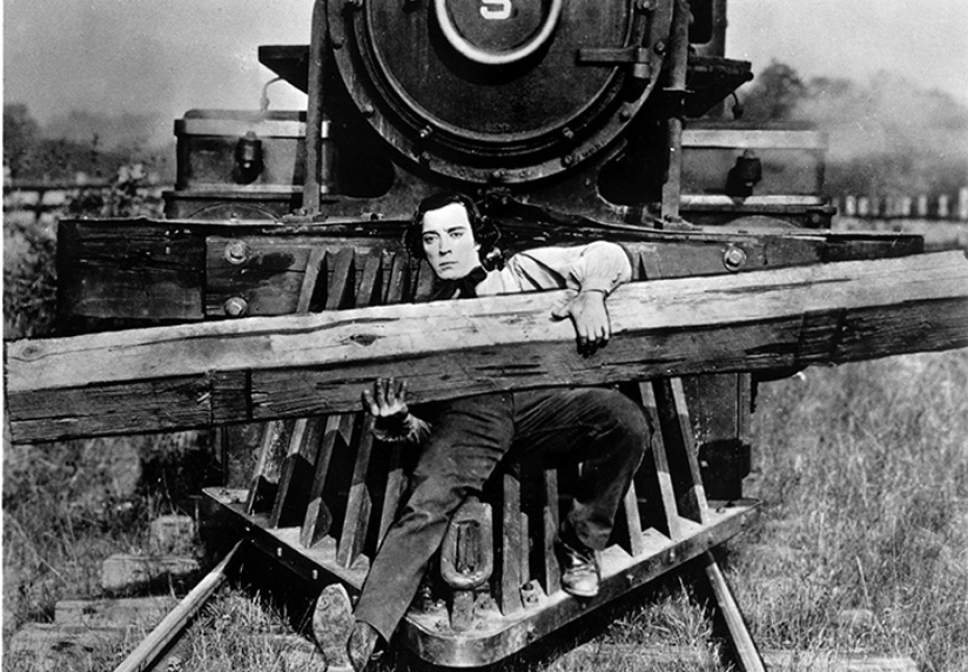

---
aliases:
- /note/2020/05/clearing-the-tracks-as-we-go-is-part-of-the-fun/
category: note
date: 2020-05-10 17:31:00-07:00
slug: clearing-the-tracks-as-we-go-is-part-of-the-fun
syndication:
  mastodon: https://hackers.town/@randomgeek/104148037728753261
  twitter: https://twitter.com/brianwisti/status/1259709339419521024
tags:
- indieweb
- philosophy
- indieweb-is-like-boatmurdered
- losing-is-fun
title: Clearing the tracks as we go is part of the fun
created: 2024-01-15T15:26:29-08:00
updated: 2024-01-26T11:01:38-08:00
---

Buster Keaton is all of us

An ongoing conversation…

  <blockquote>If I waited until I had the perfect toolchain for it, then I’d never start. Better to <em>just start typing</em> now, and see where my impatience carries me.</blockquote>
  
—
      <a class="u-category h-card" href="https://jmac.org/">Jason McIntosh</a>,<cite>
      <a class="u-url" href="https://jmac.org/notes/oops-no-author.html">
        [<time class="dt-published">2020-05-09</time>]</a>
      </cite>
  

I agree. Sorry for the delay in replying. I needed to create and/or fake the missing pieces of my workflow so I *could* reply.

And your reply came through just fine! Course, now I need to go fix the bit where it’s not showing up on the note you’re replying to.
