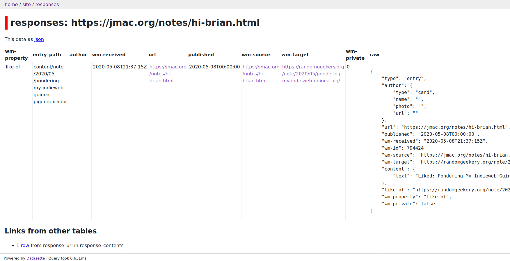

---
aliases:
- /note/2020/05/debugging-my-site-with-a-little-help-from-my-friends/
category: note
date: 2020-05-08 20:25:00-07:00
slug: debugging-my-site-with-a-little-help-from-my-friends
syndication:
  mastodon: https://hackers.town/@randomgeek/104136380782825124
  twitter: https://twitter.com/brianwisti/status/1258962728649134090
tags:
- indieweb
- data
- i-fixed-it
- before-i-pushed-it
- yay-for-tests
title: Debugging My Site With a Little Help From My Friends
created: 2024-01-15T15:26:33-08:00
updated: 2024-01-26T11:01:36-08:00
---

 > 
 > It’s probably redundant to test HTML structure for my pages, but [what the heck](../03/passing-tests-is-now-required-to-push.md).
 > 
 > -- <cite>Me, a couple months ago</cite>

 > 
 > There’s no rule, but *obviously* every webmention to my site will have
 > full author info including photo.
 > 
 > -- <cite>Me, a few weeks ago</cite>

 > 
 > Look honey I added *inbox/Webmention* data to my [Datasette dashboard](datasette-sure-is-nifty.md)!
 > 
 > -- <cite>Me, this morning</cite>

 > 
 > Sweet, jmac liked my [mention](pondering-my-indieweb-guinea-pig.md)!  Wait why are tests failing? Maybe check
 > the dashboard?
 > 
 > -- <cite>Me, an hour ago</cite>

 > 
 > I fixed it!
 > 
 > -- <cite>Me, a few minutes ago</cite>

The fix is reasonable defaults for response author info. I got other fixes in mind, including a default "card" for anonymous response authors. Also, inferring author info from source site. Thanks for the help and the ideas, [Jason McIntosh](https://jmac.org)!
