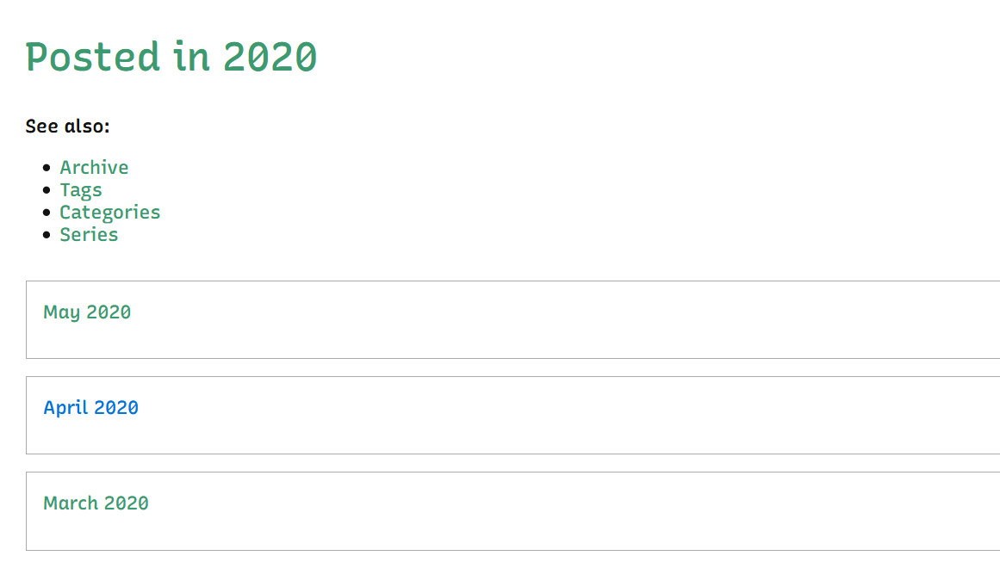

---
aliases:
- /note/2020/05/i-added-10-seconds-to-build-time/
category: note
date: 2020-05-13 23:22:00-07:00
slug: i-added-10-seconds-to-build-time
syndication:
  twitter: https://twitter.com/brianwisti/status/1260821840525529089
tags:
- like-the-tide
- build-time-go-down
- build-time-go-up
- way-up
- still-feels-good
- site
title: I Added 10 Seconds to Build Time!
---

the page needs work and so does this screenshot

I finally have year/month archives on my site. Bookmarked a [post](https://blog.atj.me/2017/10/generate-yearly-and-monthly-archive-pages-with-hugo-sections/) on the topic by [Adam Jarret](https://blog.atj.me/) a while back. Finally did it. In Perl, though. Not Node.js.

The build time problem comes from following his template logic - based on a Jekyll plugin. Got some ideas, but they'll wait. Now it's bedtime.
