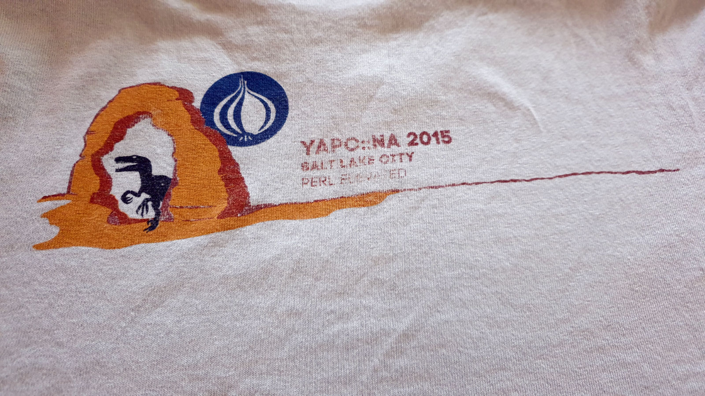

---
aliases:
- /note/2020/05/pondering-my-indieweb-guinea-pig/
category: note
created: 2024-01-15 15:26:33-08:00
date: 2020-05-03 20:30:00-07:00
slug: pondering-my-indieweb-guinea-pig
syndication:
  mastodon: https://hackers.town/@randomgeek/104108152121137583
tags:
- indieweb
title: Pondering My Indieweb Guinea Pig
updated: 2024-02-01 20:37:15-08:00
---

Can't throw the YAPC::NA shirt away yet. Hasn't worn through completely

<a class="u-category h-card" href="https://jmac.org">Jason McIntosh</a> seems like a reasonable choice to test [Webmention](../../../card/Webmention.md) on. I wouldn’t know about the [IndieWeb](../../../card/IndieWeb.md) if not for him. I know I’ll try his [Web::Mention](https://metacpan.org/pod/Web::Mention) library eventually. But first, [webmention-tools](https://github.com/Ryuno-Ki/webmention-tools).

The other stuff didn’t work and didn’t give useful errors. I ended up using Web::Mention. It’s fine. Just half to rewrite half the post. That’s fine.

 > 
 > **NOTE**
>
 > The other stuff didn't work and didn't give useful errors.  I ended up using Web::Mention.  It's fine.  Just have to rewrite half the post.  That's fine.