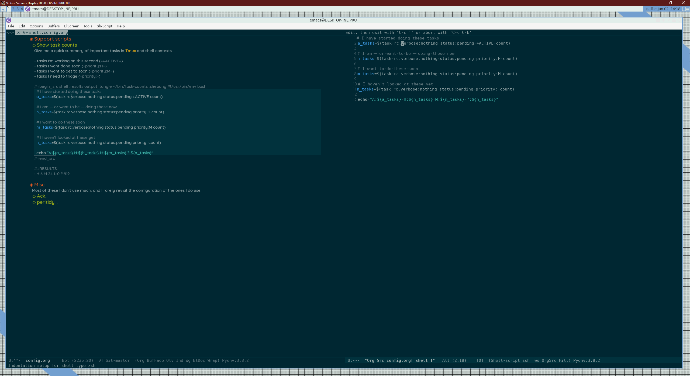

---
aliases:
- /note/2020/06/not-saying-this-is-a-good-idea/
category: note
date: 2020-06-02 14:45:01-07:00
slug: not-saying-this-is-a-good-idea
syndication:
  mastodon: https://hackers.town/@randomgeek/104276607705004263
  twitter: https://twitter.com/brianwisti/status/1267937575383248904
tags:
- screenshot
- awesomewm
- wsl
- emacs
title: Not saying this is a good idea
---

One big window for [VcXsrv](https://sourceforge.net/projects/vcxsrv/). [awesomewm](https://awesomewm.org/) for a window manager. Mainly to manage maximized [Emacs](../../../card/Emacs.md). There are easier ways to edit files in Windows and *inbox/WSL*. But it renders prettier fonts than VcXsrv with floating windows, so I think I'll keep it. After I fix all the hotkeys, of course.

I used [this post](https://solarianprogrammer.com/2017/04/16/windows-susbsystem-for-linux-xfce-4/) from [Paul Silisteanu](https://solarianprogrammer.com/) as a general guide, except `apt install awesome awesome-extra` for the awesomewm  stuff.
