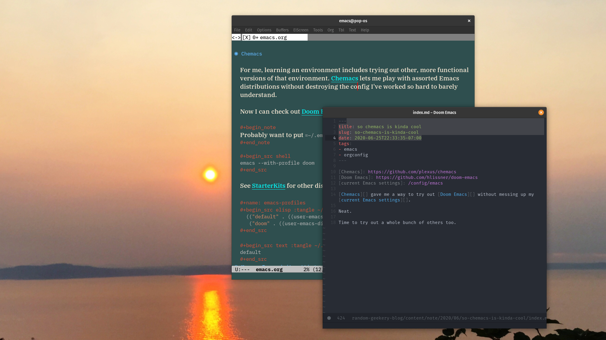

---
aliases:
- /note/2020/06/so-chemacs-is-kinda-cool/
category: note
created: 2024-01-15 15:26:25-08:00
date: 2020-06-25 22:33:35-07:00
slug: so-chemacs-is-kinda-cool
syndication:
  mastodon: https://hackers.town/@randomgeek/104408712351182709
  twitter: https://twitter.com/brianwisti/status/1276392251489476608
tags:
- emacs
- orgconfig
title: so chemacs is kinda cool
updated: 2024-01-26 11:00:27-08:00
---

[Chemacs](https://github.com/plexus/chemacs) gave me a way to try out [Doom Emacs](https://github.com/hlissner/doom-emacs) without messing up my current [Emacs](../../../card/Emacs.md) settings.

Neat.

Time to try out a whole bunch of others too.