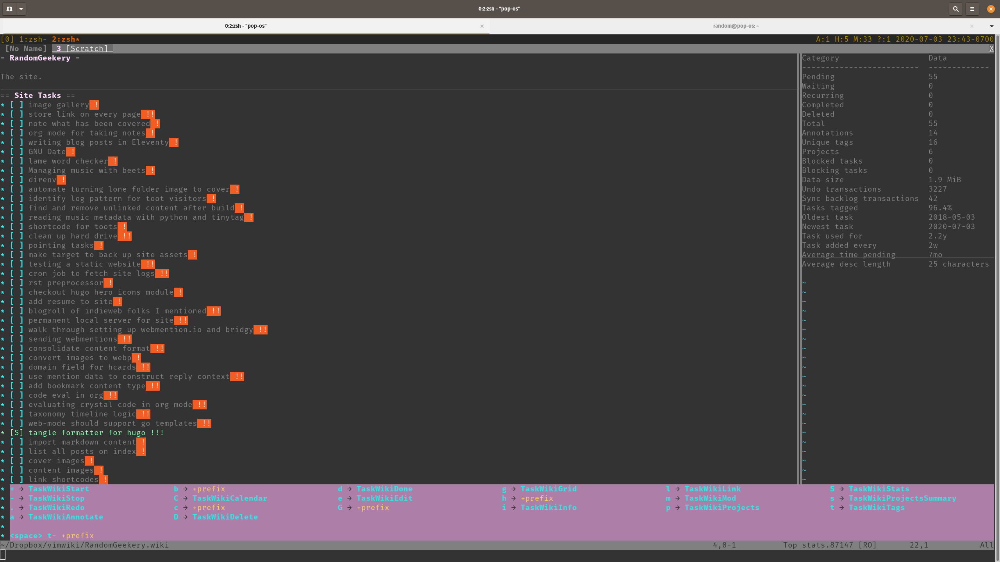

---
aliases:
- /note/2020/07/orgmode-ish-vimwiki/
category: note
created: 2024-01-15 15:26:25-08:00
date: 2020-07-03 23:51:27-07:00
slug: orgmode-ish-vimwiki
syndication:
  mastodon: https://hackers.town/@randomgeek/104454330012908769
  twitter: https://twitter.com/brianwisti/status/1279311746658951169
tags:
- vim
- taskwarrior
- orgmode
title: OrgMode-ish VimWiki
updated: 2024-02-01 20:34:07-08:00
---

I just wanted to see if I can something like the [Org](../../../card/Org.md) experience in [Vim](../../../card/Vim.md) without [vim-orgmode](https://github.com/jceb/vim-orgmode). I can. Sort of. Using [Vimwiki](https://vimwiki.github.io/) with [TaskWiki](https://github.com/tbabej/taskwiki) for Taskwarrior integration. Not appearing in this image: [vim-table-mode](https://github.com/dhruvasagar/vim-table-mode). Appearing but not relevant to the Org-ish experiment is [vim-which-key](https://github.com/liuchengxu/vim-which-key). Completely missing: any sort of [Babel](https://orgmode.org/worg/org-contrib/babel/intro.html) code evaluation/tangling.

That agenda-ish task list is *real* cool but needs to show more info, like tags.