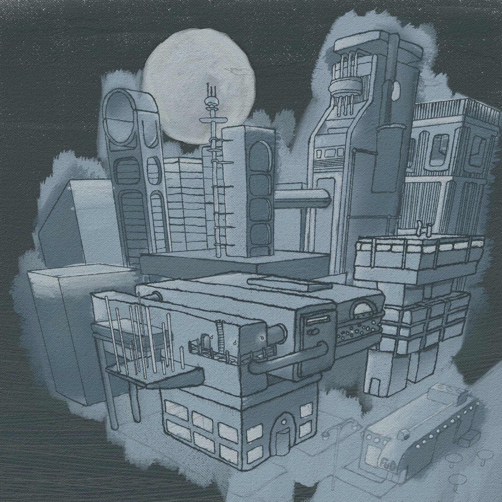

---
aliases:
- /note/2020/08/slow-city-doodle/
category: note
date: 2020-08-01 19:16:41-07:00
slug: slow-city-doodle
syndication:
  mastodon: https://hackers.town/@randomgeek/104617719550214827
  twitter: https://twitter.com/brianwisti/status/1289768405642424323
tags:
- drawing
- infinite-painter
title: Slow City Doodle
---

I put a shocking amount of effort in making sure this didn't look overly polished. Seriously. Got to "nearly finished" a few times, and scrapped it because it looked too mechanical.

Okay sure. I'm drawing a science fiction cityscape on my phone. Doesn't mean it has to look like blueprints.
