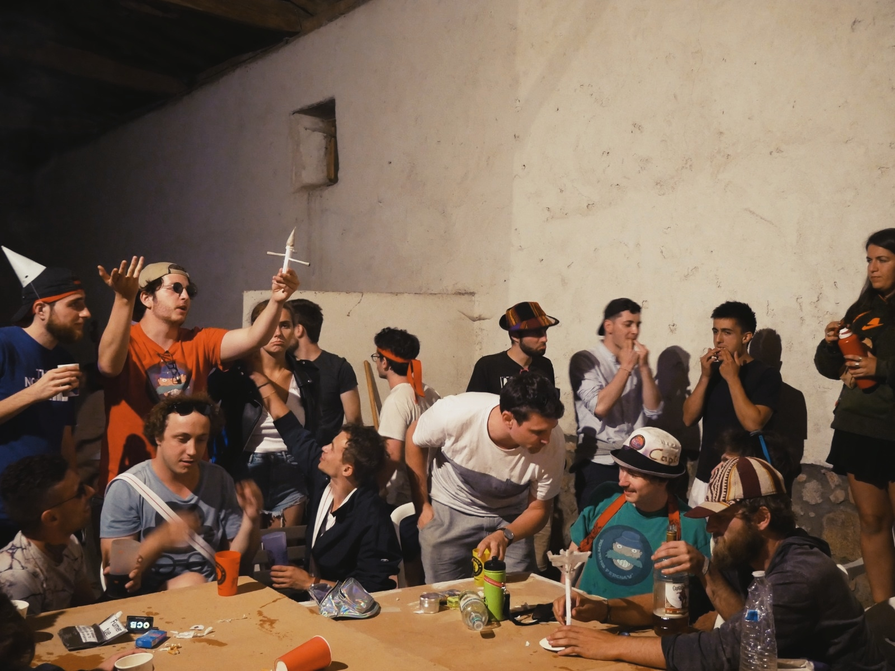

---
aliases:
- /note/2020/09/accidental-renaissance-the-rolling-contest/
category: note
created: 2024-01-15 15:26:24-08:00
date: 2020-09-19 22:57:36-07:00
slug: accidental-renaissance-the-rolling-contest
syndication:
  mastodon: https://hackers.town/@randomgeek/104895757982720260
  twitter: https://twitter.com/brianwisti/status/1307563412852011015
tags:
- accidental-renaissance
- found-online
- it-s-art
title: 'Accidental Renaissance: The rolling contest'
updated: 2024-01-26 11:00:07-08:00
---

Somebody posted their pic to [Imgur](https://imgur.com/e6BNB31). I saw it [on Reddit](https://www.reddit.com/r/AccidentalRenaissance/comments/ivxfp7/the_rolling_contest/). I spent more time scrutinizing this image than I'll admit. It's just so perfect. It couldn't *possibly* be accidental. Could it?

This is art.