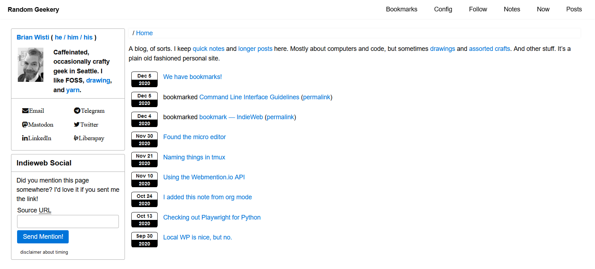

---
aliases:
- /note/2020/12/new-theme-for-2021/
category: note
created: 2024-01-15 15:26:22-08:00
date: 2020-12-07 07:16:55-08:00
slug: new-theme-for-2021
syndication:
  mastodon: https://hackers.town/@randomgeek/105337729433550032
  twitter: https://twitter.com/brianwisti/status/1335849446018527234
tags:
- css
- spring-cleaning-for-websites
- site
title: New theme for 2021
updated: 2024-01-26 10:59:43-08:00
---

I don't care if it's not 2021 yet. I'm starting now, with [Picnic CSS](https://picnicss.com) for the foundation.

Funny thing about 20-year old sites. They take more than a weekend to revamp. Still kind of funky, but I'll fix it eventually.

2022 at the latest.