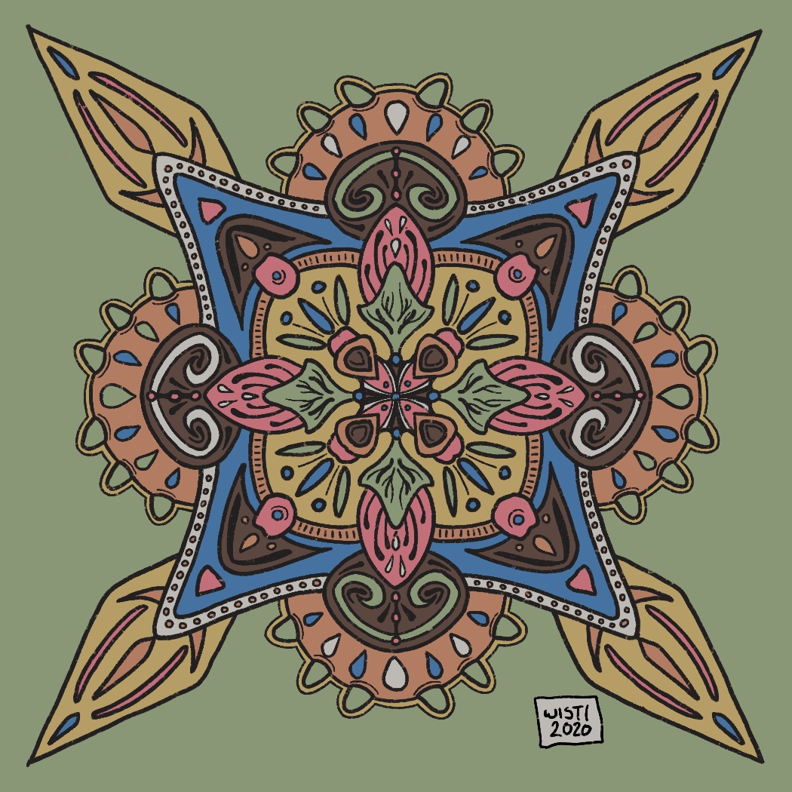

---
aliases:
- /note/2020/12/something-new-to-color/
category: note
created: 2024-01-15 15:26:21-08:00
date: 2020-12-18 23:15:00-08:00
slug: something-new-to-color
syndication:
  mastodon: https://hackers.town/@randomgeek/105405719066000943
  twitter: https://twitter.com/brianwisti/status/1340200841014329346
tags:
- drawing
- symmetry
- color-me
- procreate
title: Something new to color
updated: 2024-01-26 10:59:41-08:00
---

Roughly four hours of bedtime drawing over the last few days. The challenge of a brain that has to timeshare hobbies.

But hey, I remembered to leave the linework layer alone this time. You can color your own if you want!

