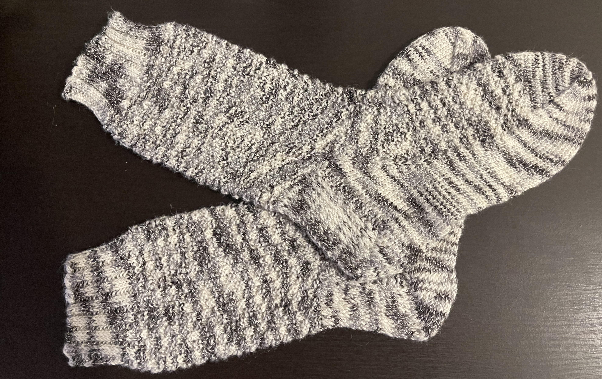

---
aliases:
- /post/2021/01/deidres-double-moss-socks/
category: post
date: 2021-01-01 00:00:00-08:00
description: I'm just glad I finished them
slug: deidres-double-moss-socks
syndication:
  mastodon: https://hackers.town/@randomgeek/105483423527454224
  twitter: https://twitter.com/brianwisti/status/1345173714409828353
tags:
- knitting
- socks
- craft
title: Deidre's Double Moss Socks
created: 2024-01-15T15:26:20-08:00
updated: 2024-01-26T10:59:28-08:00
---

blocked and ready to wear

Took me six months to make these. It’s a good thing she likes them!

# The pattern

Using [Sensational Knitted Socks](https://www.goodreads.com/book/show/399836.Sensational_Knitted_Socks) by Charlene Schurch, as usual.
Been a while since I knitted any socks, so I went with a safe [moss
stitch](https://www.gathered.how/knitting-and-crochet/knitting/moss-stitch/) fallback.

# The yarn

brand
: Think Bamboo

style
: B917

color
: 992

composition
: 45% bamboo, 40% wool, 15% nylon

site
: https://thinkbamboo.com; doesn't work for me at the moment

The yarn is pretty, and works nice once you get going.  It is beyond a hassle
to wind up, though.

# The review

<blockquote class="twitter-tweet">
Omg my beautiful handmade socks are so soft and a thing of BEAUTY <a href="https://t.co/cXmYHyI1CC">pic.twitter.com/cXmYHyI1CC</a>
&mdash; Deidre Wisti (@IamMrsGeek) <a href="https://twitter.com/IamMrsGeek/status/1341594975629283328?ref_src=twsrc%5Etfw">December 23, 2020</a></blockquote> 
