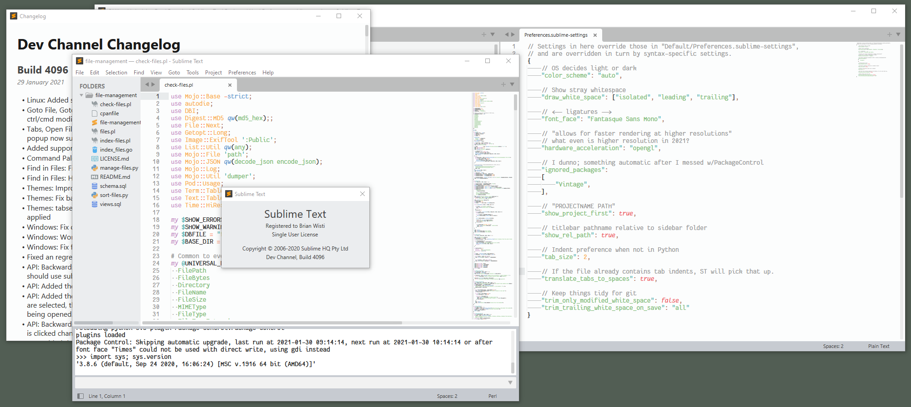

Yesterday's dev build plus [A File Icon](https://packagecontrol.io/packages/A%20File%20Icon)

[Terence Martin](https://odatnurd.net) posted a couple helpful videos [explaining](https://youtu.be/P52ZBQvAAsU) version licensing and the impending changes to the [Sublime Text](https://www.sublimetext.com) text editor, along with some tips on [getting started](https://youtu.be/_HoltQwvF2o) with "version 4." So nice I watched them twice.

A real subscription, where you get to keep the builds you paid for.  I like this.

Okay, sure.  Sublime Text isn’t open source.  Version releases are few and far between. But it’s *good* — the only graphical text editor I’ve used that feels as responsive as [card/Vim](../../../card/Vim.md).

I love supporting independent development when I can.  A subscription approach is more sustainable for developers and more satisfying for users than the (extremely) intermittent bursts of version-based licensing.  There’s nothing official, so I don’t know what’s really happening.  The [Sublime Discord](https://discord.gg/HcmwdVK) "announcements" channel holds the details.

Python 3.8.6. Good stuff!
