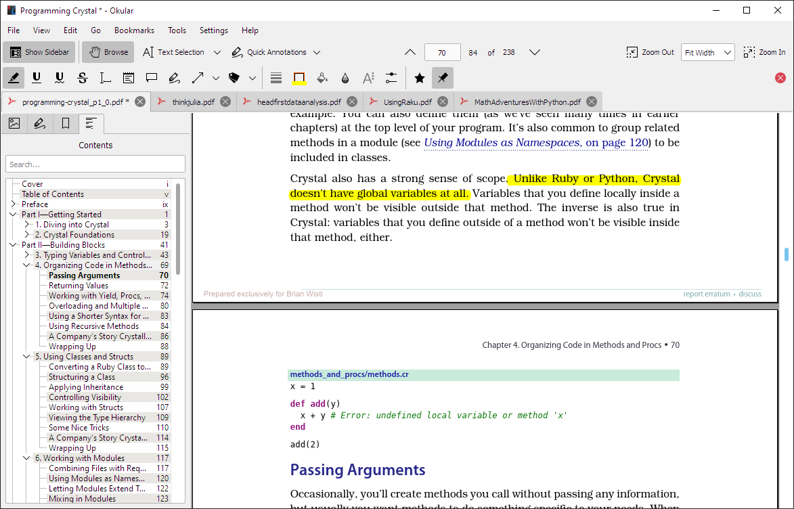

---
aliases:
- /note/2021/02/just-noticed-okular-pdf-is-on-windows/
category: note
date: 2021-02-19 11:37:37-08:00
slug: just-noticed-okular-pdf-is-on-windows
syndication:
  dev-to: https://dev.to/brianwisti/note-just-noticed-okular-pdf-is-on-windows-31jh
  mastodon: https://randomgeekery.org/blog/2021/just-noticed-okular-pdf-is-on-windows/
tags:
- windows
- tools
title: Just noticed Okular PDF is on Windows
created: 2024-01-15T15:26:20-08:00
updated: 2024-01-26T10:22:22-08:00
---

Okular document viewer with several tabs open including "Programming Crystal"

[Okular](https://okular.kde.org), the *inbox/KDE* document viewer, works on Windows. Not only that, but it's available in the [Microsoft Store](https://www.microsoft.com/en-us/p/okular/9n41msq1wnm8).

Free, obviously.

This should help keep annotations in order as I work through my TOREAD stack — three chapters down, only several hundred books to go —regardless of current operating system.
