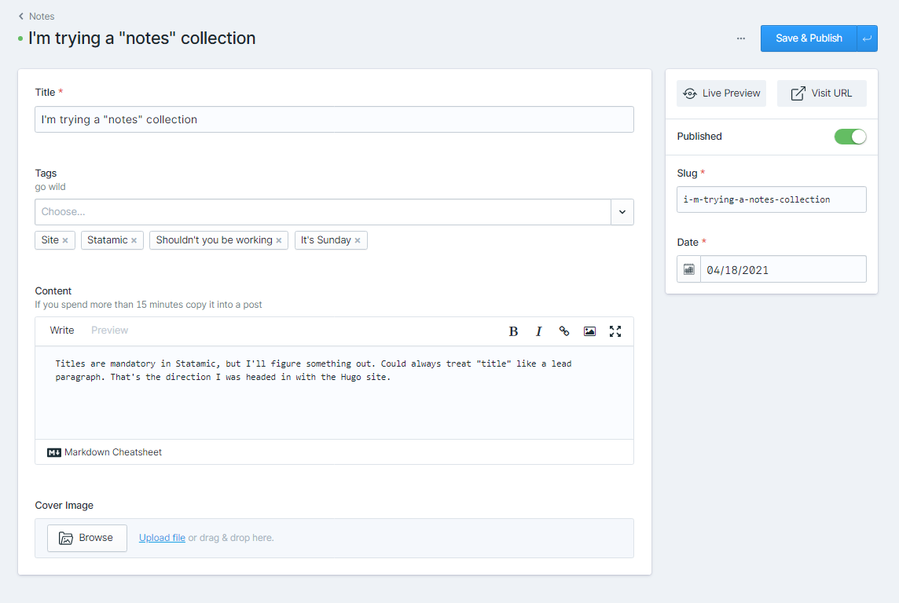

---
aliases:
- /note/2021/04/i-m-trying-a-notes-collection/
category: note
date: 2021-04-18 00:00:00-07:00
slug: i-m-trying-a-notes-collection
tags:
- site
- statamic
- shouldn-t-you-be-working
- it-s-sunday
title: I'm trying a "notes" collection
---

Using [card/Statamic](../../../card/Statamic.md) for the site this split second. Titles are mandatory in Statamic, but I'll figure something out. Could always treat "title" like a lead paragraph. That's the direction I was headed in with the Hugo site.

Course, I already changed my blueprint layout from the screenshot.
