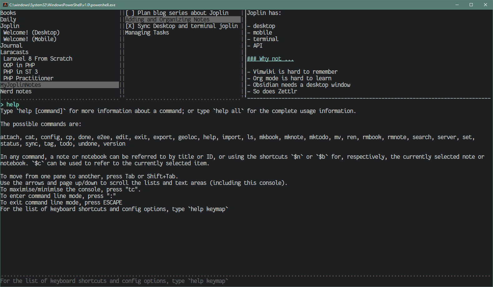

Joplin's terminal view of my notebooks

Look.  I don’t know if [card/Joplin](../../../card/Joplin.md) is going to be my note manager of choice.  I don’t even know if I’ll still be using it next week.  It’s cool. I’m just not that consistent.

But there’s these notes.  Why not share them?  Someone out there might make use of them.

Just give me a minute to turn the bullet points into sentences.

# What?

Try out Joplin’s [terminal application](https://joplinapp.org/terminal/) for typing up and organizing quick notes.

# Why?

I’m often taking notes.  It’s the only way I can remember the little things. You can find a note-taking app whatever your preferences are.  I spend a lot of time in the terminal.  I don’t want to *leave* the terminal when deep in concentration.

Joplin has a terminal application.  It also has lovely [desktop](https://joplinapp.org/desktop/) and [mobile](https://joplinapp.org/mobile/) applications.

But we’re just looking at the terminal application.

## Why not …

Like I said: there are a lot of options.  I regularly play with several of them.  But for the kind of "quick get this down before I forget it?"

* [Vimwiki](https://vimwiki.github.io/) is hard to remember
* [card/Org](../../../card/Org.md) is hard to learn, or at least hard to master; and the temptation to fuss around is too strong
* [card/Obsidian](../../../card/Obsidian.md) needs a desktop window
* so does [card/Zettlr](../../../card/Zettlr.md)

So for today it’s Joplin.

# Setup

Joplin runs on NodeJS, so install it with [card/Volta](../../../card/Volta.md), Yarn, NPM, or whatever you install Node stuff with.

````text
$ volta install joplin
success: installed joplin@1.6.4 with executables: joplin
````

Now there’s a `joplin` command in your path!

````text
joplin
````

You get these four panes you can tab around in, and — look, Joplin’s [usage](https://joplinapp.org/terminal/#usage) docs break it down better than I could.  Go look at those.

# Basic usage

Joplin has a command line mode, which you get at with the colon character `:`.  Gonna focus on that command line mode.

The first and most important command?

````text
:help
````

That gives you a list of commands, including the second most important command.

````text
:exit
````

Not `:quit`.  Not `:wq`.  No.  Joplin’s terminal application is kind of inspired by [card/Vim](../../../card/Vim.md), but it is not Vim.

# Setting up note synchronization

I’ve already been using Joplin elsewhere, so *my* first task is to configure [synchronization](https://joplinapp.org/terminal/#synchronisation).

The `sync` needs no additional arguments when used with Dropbox, lucky for me.

````text
:sync
````

Joplin gives me:

* a URL to copy and paste into the browser
* a prompt to enter Dropbox’s validation code

From there?

1. follow the link with a `[Control]` + click (in my terminal, at least)
1. allow the integration; Dropbox gives me a string of nonsense text
1. copy that nonsense and paste it into Joplin’s prompt

If you’re me, the leftmost pane fills with folders from your previous Joplin sessions.  The screenshot you already saw, pretty much.

## Creating a note

````text
:mknote "Terminal notes with Joplin"
````

The quotes aren’t needed for single-word notes.  But for multi-word notes it’s either wrap it in quotes or use CamelCase.

I can see it’s up there in the middle tab, but now I’m obsessing over the command line mode.  Is there an `ls` equivalent?  There sure is!

````text
:ls
Terminal notes with Joplin
````

## Editing a note

````text
:edit "Terminal notes with Joplin"
````

Joplin offers a chance to autocomplete once I type enough in.  I accept that autocompletion with `[TAB]`, then hit `[ENTER]` to complete the command.

This passes the note buffer off to your default text editor — in my case,
[micro](https://micro-editor.github.io/).

The notes themselves are in a straightforward Markdown.  See [Joplin's Markdown guide](https://joplinapp.org/markdown/) for those details.

Keep in mind that this is just a Markdown file to your editor.  Any impressive integration with Joplin requires work in the editor config.  I have not done anything with that yet.  I use Joplin’s desktop app for anything fancier than jotting down quick notes.

Edit.  Save.  Quit the editor.  You’re back in Joplin, and your updated content is in Joplin’s content pane.

## Deleting a note

I forgot about the quotes and made myself a "Terminal" note.  How do I delete it?

````text
:rmnote Terminal
````

Joplin asks for confirmation, defaulting to "No" because you can’t get the note back once deleted.

## Organizing notes into notebooks

I can see this becoming a whole series of notes.

````text
:mkbook MyJoplinNotes
````

Didn’t feel like using quotes this time.  Anyways, "MyJoplinNotes" gets created at the top level.  Joplin automatically sets it as the notebook I’m using.

"Using" a particular notebook means this is where your focus is.  Any new notes you create end up in the notebook you’re using.

I need to get *this* note over to the right location.  First I `use` the random notebook I started in.

````text
:use 'Nerd notes'
````

My first round notebook names tend to be terrible. Sorry.

## Moving notes

Now I can move it, letting Joplin help me with autocompletion.

````text
:mv 'Terminal notes with Joplin' MyJoplinNotes
````

Switch over to the new notebook:

````text
:use MyJoplinNotes
````

And there it is.

````text
:ls
Terminal notes with Joplin
````

## Renaming notes

Of course, now that it’s in a dedicated notebook the name seems redundant. Let’s rename this note.

````text
:ren 'Terminal notes with Joplin' 'Adding and Organizing Notes'
````

# Parting thought

Even though Joplin keeps a narrow focus, there’s much more than I looked at here.  I just wanted to take some notes.  You can manage tasks with it, and even extend it with an API.

Keep your notes short, unless your editor supports folding.  If it does?  Go wild.  Have fun!
