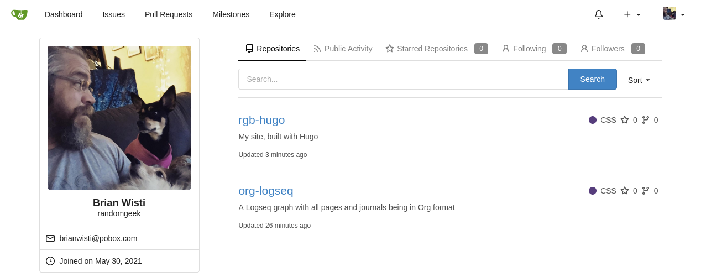

---
aliases:
- /note/2021/05/gitea-because-shiny/
category: note
date: 2021-05-30 00:00:00-07:00
slug: gitea-because-shiny
syndication:
  mastodon: https://hackers.town/@randomgeek/106327746467350327
  twitter: https://twitter.com/brianwisti/status/1399210560806346756
tags:
- tools
- git
- so-pretty
title: I installed Gitea because it is shiny not because it is needed
---

Been wanting to reduce my dependency on Github / Gitlab / etc for a while. I could've used a simpler and more mundane approach. But [Gitea](https://gitea.io/) is just too tempting.
