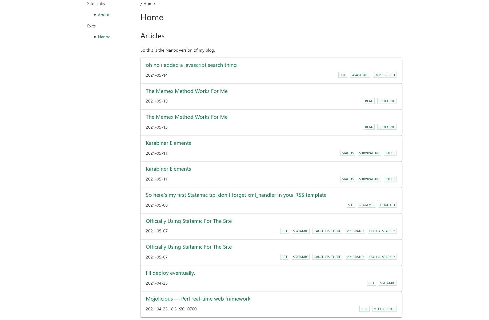

---
aliases:
- /note/2021/05/not-sure-why-i-keep-fussing-with-ssgs/
category: note
date: 2021-05-16 00:00:00-07:00
slug: not-sure-why-i-keep-fussing-with-ssgs
syndication:
  mastodon: https://hackers.town/@randomgeek/106249167776741009
  twitter: https://twitter.com/brianwisti/status/1394181072125140999
tags:
- static-site-generators
- nikola
- nanoc
- spinning-wheels
title: Not sure why I keep fussing with every single SSG. It's fun, I guess?
---

So after bouncing back to [card/Hugo](../../../card/Hugo.md) from a brief [card/Statamic](../../../card/Statamic.md) experiment, what do I do? Do I post the slides from a talk I gave the other day, like I promised?

No of course not.

I spent the weekend messing with [Nanoc](https://nanoc.app) and [Nikola](https://getnikola.com). Still chasing the high of the perfect site generator? Maybe.

Nikola's got the convenience thing down. Someone can sit and start a fresh blog quick.

Nanoc's got this sort of friendly flexibility. It's been able to handle every idea so far. Obviously not nearly as fast as Hugo, but fast enough if you don't get carried away with images and templates.

Guess what I like to do. I like to get carried away with images and templates.

Might play more with Nanoc. Might get back to tuning the Hugo site.

Been sort of eyeballing [Elder.js](https://elderguide.com/tech/elderjs/) and [Vitepress](https://vitepress.vuejs.org/) too. Sort-of-static sounds like fun.
