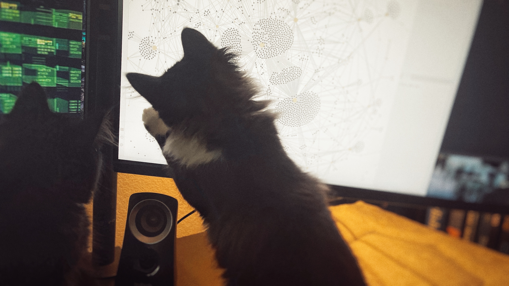

---
aliases:
- /note/2021/07/our-cats-give-me-more-reason-to-use-the-terminal/
category: note
date: 2021-07-05 00:00:00-07:00
slug: our-cats-give-me-more-reason-to-use-the-terminal
syndication:
  mastodon: https://hackers.town/@randomgeek/106530495121960572
  twitter: https://twitter.com/brianwisti/status/1412186131689619456
tags:
- look
- kitties
- cuteness
title: Our cats give me more reason to use the terminal
created: 2024-01-15T15:26:09-08:00
updated: 2024-02-01T20:34:22-08:00
---

the cats help identify orphan nodes in an Obsidian.md vault graph

Trying to use the mouse? Play a video game? Look at your [Obsidian](../../../card/Obsidian.md) graph? Experiment with the [Logseq](../../../card/Logseq.md) `/draw` command? The cats are there to help.

Do I mind? Not a bit. Keeps me in the terminal. Helpful for focus. Though I sometimes wish they weren't  *quite* so helpful with the video games.

They're just doing their part!
