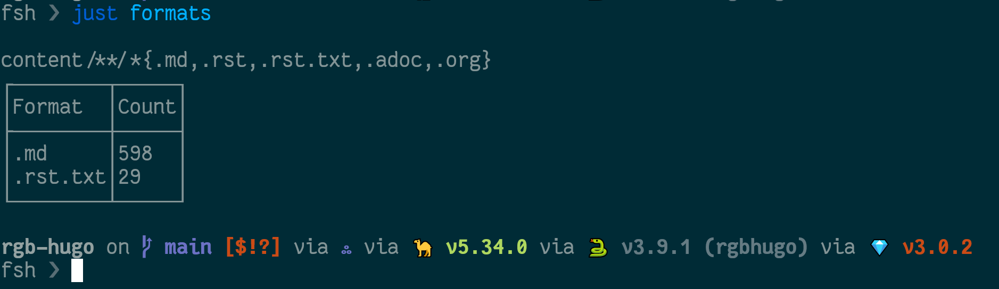

---
aliases:
- /note/2021/08/pared-down-to-the-base-blog/
category: note
created: 2024-01-15 15:26:13-08:00
date: 2021-08-21 00:00:00-07:00
slug: pared-down-to-the-base-blog
syndication:
  mastodon: https://hackers.town/@randomgeek/106798500227834335
tags:
- ssg
- site
title: pared down to the base blog
updated: 2024-02-01 20:35:28-08:00
---

My `rst.txt` files become HTML before the SSG sees, so I may leave them

No more content shortcodes. No more — or at least not many — exotic content formats. Embedded video or tweet? Copy and paste the embed code from the host site. Need some fancy HTML for notes? Use raw HTML.

I need a base blog, with minimal dependencies on [Hugo](../../../card/Hugo.md) or any other [Static Site Generator](../../../card/Static%20Site%20Generator.md), so I can get serious with some of those others. "I'd need to port all my shortcodes" has blocked me from switching for the last year and a half (you accumulate a lot of cruft using the same site builder for six years). Now it won't be such a blocker.

Plus, I can try the fancy stuff in [Astro](../../../card/Astro.md) or [Lektor](../../../card/Lektor.md) or whatever and still have the base blog to fall back on. Heck, I could port the base blog to [Eleventy](../../../card/Eleventy.md) or [Zola](../../../card/Zola.md) or …