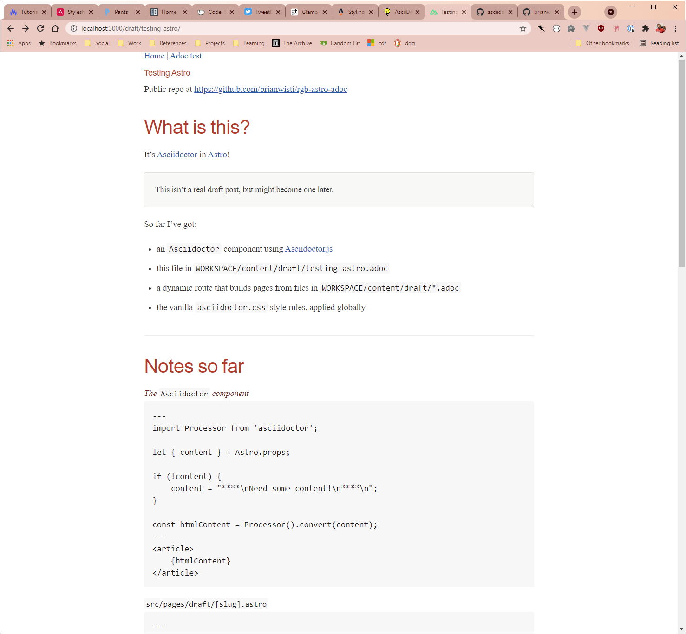

---
aliases:
- /note/2021/09/look-at-me-with-one-asciidoctor-page-in-an-astro-site/
category: note
date: 2021-09-18 00:00:00-07:00
slug: look-at-me-with-one-asciidoctor-page-in-an-astro-site
syndication:
  mastodon: https://hackers.town/@randomgeek/106955981875204527
  twitter: https://twitter.com/brianwisti/status/1439417348600045569
tags:
- asciidoctor
- astro-dot-build
title: Look at me with one Asciidoctor page in an Astro site
---

I wanted [card/Asciidoctor](../../../card/Asciidoctor.md) in [card/Astro](../../../card/Astro.md). It took some fiddling, but not as much
as expected. It's a good start.

I won't bore you with the details. Maybe later when there are more details to bore you with.

Now for the other 600 pages.
