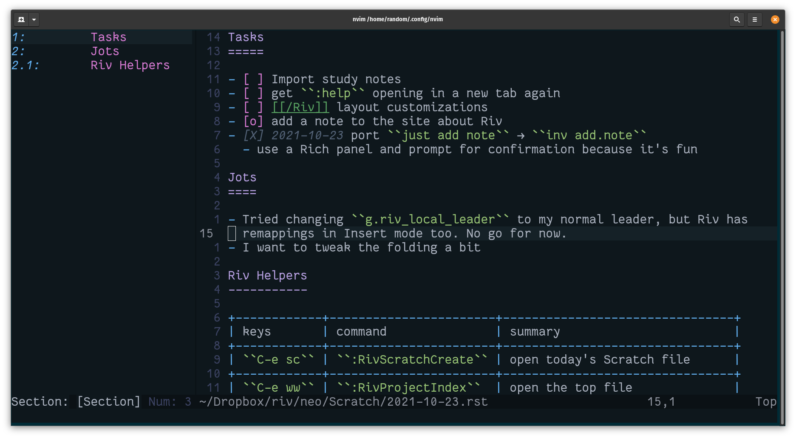

---
aliases:
- /note/2021/10/try-riv-if-you-like-vim-and-restructuredtext/
category: note
date: 2021-10-23 00:00:00+00:00
slug: try-riv-if-you-like-vim-and-restructuredtext
syndication:
  mastodon: https://hackers.town/@randomgeek/107152087542609813
  twitter: https://twitter.com/brianwisti/status/1451968452789522434
tags:
- vim
- rst
- second-brain
title: Try Riv if you like Vim and reStructuredText
---

Riv screenshot

[Riv](https://github.com/gu-fan/riv.vim) is a wiki, but feels like more of a notebook. Think [Deft for Emacs](https://jblevins.org/projects/deft/) with journaling and HTML publishing. What makes Riv interesting — aside from the [Vim](https://www.vim.org/) thing — is that it uses [reStructuredText](https://docutils.sourceforge.io/) for its native format.

It works well enough, especially once you build up muscle memory for Riv's leader sequence <kbd>C-e</kbd>. Don't overload it right away though! It includes some insert mode mappings, which can get real confusing if your preferred leader is a space.

Meanwhile I got a lot of [card/Neovim](../../../card/Neovim.md) ideas. Course, I need to get some more practice in with [pynvim](https://pynvim.readthedocs.io/en/latest/) first. And I suppose some more practice with Riv.
