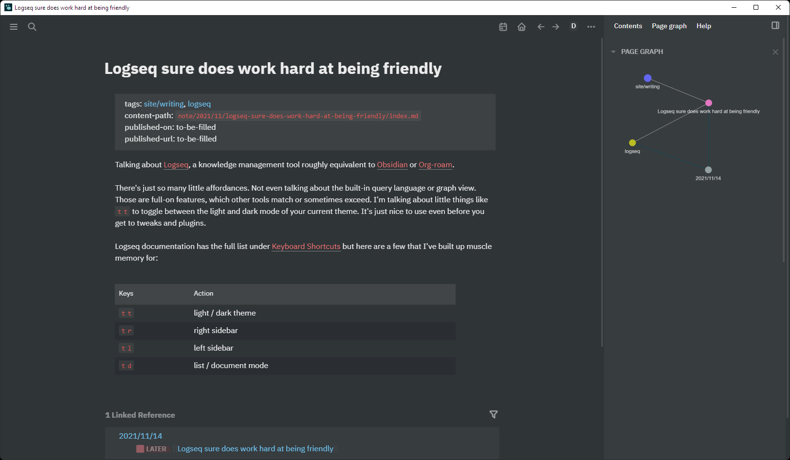

---
aliases:
- /note/2021/11/logseq-sure-does-work-hard-at-being-friendly/
category: note
date: 2021-11-14 00:00:00+00:00
slug: logseq-sure-does-work-hard-at-being-friendly
syndication:
  mastodon: https://hackers.town/@randomgeek/107277879832911179
tags:
- logseq
title: Logseq sure does work hard at being friendly
created: 2024-01-15T15:26:09-08:00
updated: 2024-01-26T10:21:23-08:00
---

This note in Logseq document mode, using the [Bonofix](https://github.com/sansui233/logseq-bonofix-theme) theme

Talking about [card/Logseq](../../../card/Logseq.md), a knowledge management tool roughly equivalent to [card/Obsidian](../../../card/Obsidian.md) or [Org-roam](https://www.orgroam.com).

There's just so many little affordances. Not even talking about the built-in query language or graph view. Those are full-on features, which other tools match or sometimes exceed. I'm talking about little things like `t t` to toggle between the light and dark mode of your current theme. It's just nice to use even before you get to tweaks and plugins.

Logseq documentation has the full list under [Keyboard Shortcuts](https://logseq.github.io/#/settings/shortcut) but here are a few that I've built up muscle memory for: 

|Keys|Action|
|----|------|
|`t t`|light / dark theme|
|`t r`|right sidebar|
|`t l`|left sidebar|
|`t d`|list / document mode|
