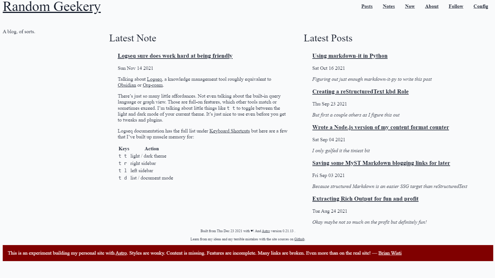

---
aliases:
- /note/2021/12/i-got-astro-working/
category: note
date: 2021-12-23 00:00:00-08:00
slug: i-got-astro-working
syndication:
  mastodon: https://hackers.town/@randomgeek/107498629085558103
  twitter: https://twitter.com/brianwisti/status/1474147038581465093
tags:
- astro-dot-build
- ssg
- site
title: I got Astro working!
---

this time you get a screenshot

[card/Astro](../../../card/Astro.md) is great once you get started. A bit funky if you have twenty years of legacy content.

Rather than do my usual — a screenshot and *maybe* a "lesson learned" post — this time around I made a public [repo](https://github.com/brianwisti/rgb-astro) and [live instance](https://quirky-wozniak-e4e36f.netlify.app) of this in-progress experiment available for your entertainment and edification.

Oh and lesson learned: components are *fussy*, and the errors don't always happen where you expect. Treat all your imported HTML as XHTML, and look for stray `{` characters. You might need to convert those to `&#123;`.

Took me months to figure that out. Hopefully it saves you a few hours of confusion.
