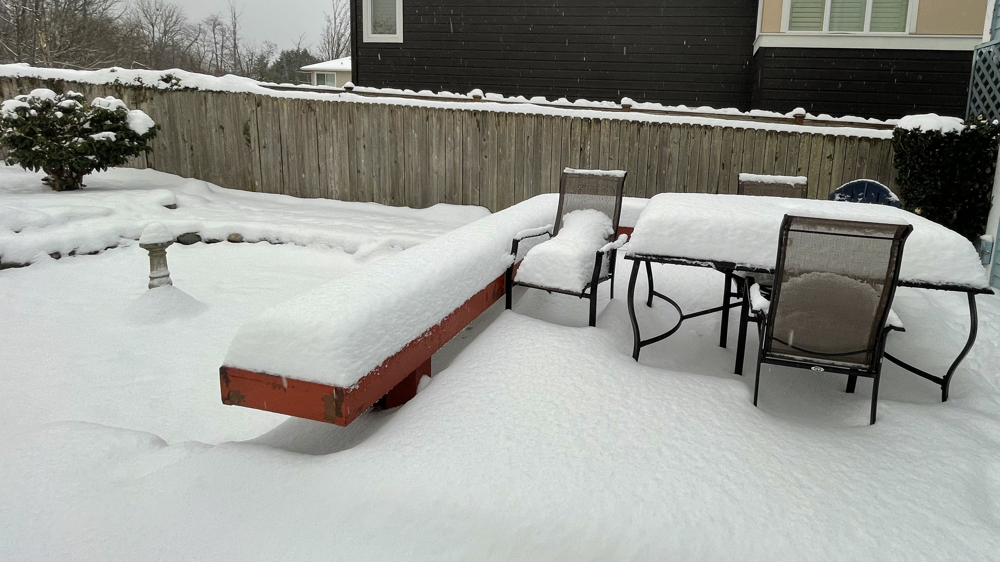

---
aliases:
- /note/2021/12/meanwhile-weather/
category: note
date: 2021-12-30 00:00:00-08:00
slug: meanwhile-weather
syndication:
  mastodon: https://hackers.town/@randomgeek/107539954739259404
  twitter: https://twitter.com/brianwisti/status/1476791597534752790
tags:
- in-local-news
- seattle
- ok-just-outside-seattle
- now
title: meanwhile, weather
created: 2024-01-15T15:26:12-08:00
updated: 2024-02-01T20:25:26-08:00
---

hey we got some snow

Would you look at that? We got some actual weather.

What else?

Been keeping myself busy with the JavaScript static site generators. Last week's [Astro](../../../card/Astro.md) experiment got slow so I've been messing with [Eleventy](../../../card/Eleventy.md).

Probably my last note of the year, so: Happy New Year!
