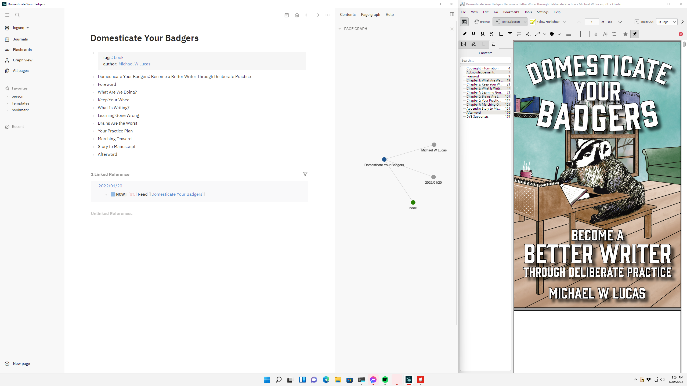

---
aliases:
- /note/2022/01/reading-domesticate-your-badgers/
category: note
date: 2022-01-20 22:00:00-08:00
slug: reading-domesticate-your-badgers
syndication:
  mastodon: https://hackers.town/@randomgeek/107659091398441430
tags:
- book
- learning-is-fun
title: Time to start reading Domesticate Your Badgers
---

study mode with Okular and Logseq

Took part in the crowdsource thing for *Domesticate Your Badgers: Become a Better Writer Through Deliberate Practice* by [Michael Warren Lucas](https://mwl.io). Now I got my PDF and it’s time to start studying.
