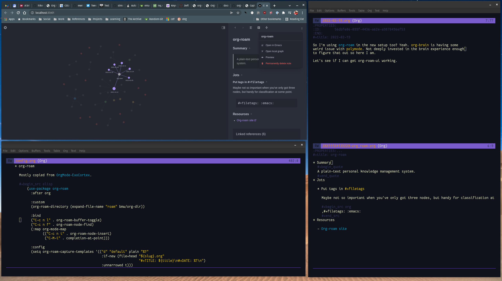

---
redirects:
- /note/2022/02/added-nano-based-emacs-config/
category: note
date: 2022-02-19 23:30:00-08:00
slug: added-nano-based-emacs-config
syndication:
  mastodon: https://hackers.town/@randomgeek/107829210164861560
tags:
- org-config
- emacs
- it-keeps-me-out-of-trouble
title: Added an Emacs config based off of nano-emacs
created: 2024-01-15T15:26:06-08:00
updated: 2024-01-26T10:20:35-08:00
---

screenshot of the Emacs setup in question, with org-roam-ui nearby

A *lot* of fiddling with Emacs today. Thought I'd try something not so much "vanilla" as on fewer predetermined rails than the average [Doom Emacs](https://github.com/hlissner/doom-emacs) config.

This new config starts from [nano-emacs](https://github.com/rougier/nano-emacs), a rather streamlined setup. Of *course* I enjoyed cluttering it up.
