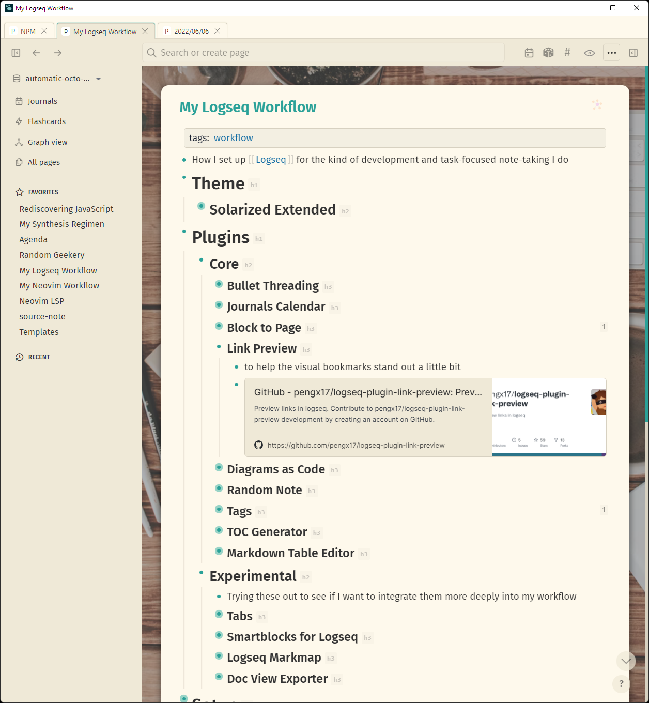

Trying to keep all my notes in one spot. Failing utterly. But hey I am coming up with some *fantastic*-looking workflows for each note application along the way.

[logseq-plugin-link-preview](https://github.com/pengx17/logseq-plugin-link-preview) and the [Solarized Extended](https://github.com/yoyurec/logseq-solarized-extended-theme) theme pair up nicely on [card/Logseq](../../../card/Logseq.md).

Logseq screenshot describing my current setup
