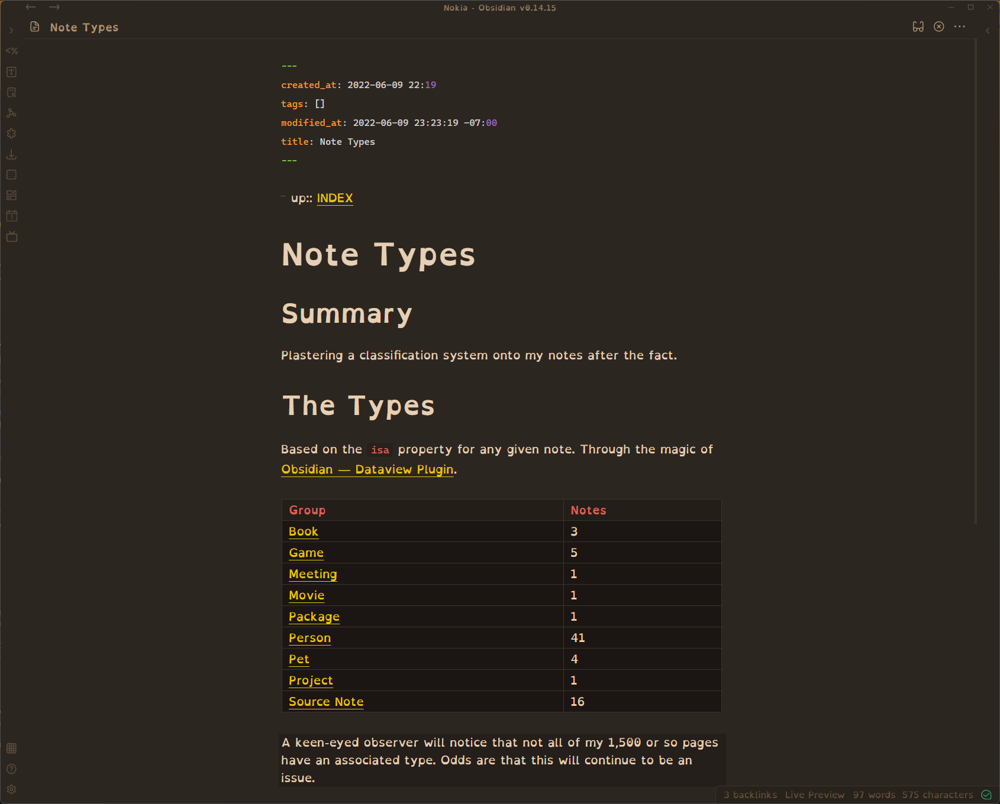

Meanwhile, in [Obsidian](../../../card/Obsidian.md):


Using an Obsidian plugin to organize the mess I made in Obsidian.

<!--more-->

[Logseq](../../../card/Logseq.md) is great. Native outlining, org-like tasks, the power of [Datalog](http://www.learndatalogtoday.org). But Obsidian has the [Dataview](https://blacksmithgu.github.io/obsidian-dataview/) plugin. What you feed it looks a lot like SQL.

````dataview
TABLE
  length(rows) as "Notes"
from ""
where isa != null
GROUP BY isa
SORT isa ASC
````

I kinda know SQL already. Enough to know what to look up to make a table of note types.

|Group|Notes|
|-----|-----|
|Book|3|
|Game|5|
|Meeting|1|
|Movie|1|
|Package|1|
|Person|41|
|Pet|4|
|Project|1|
|Source Note|16|

Nope. Haven't settled on One True Note System and I likely never will. But at least I'm enjoying myself.
