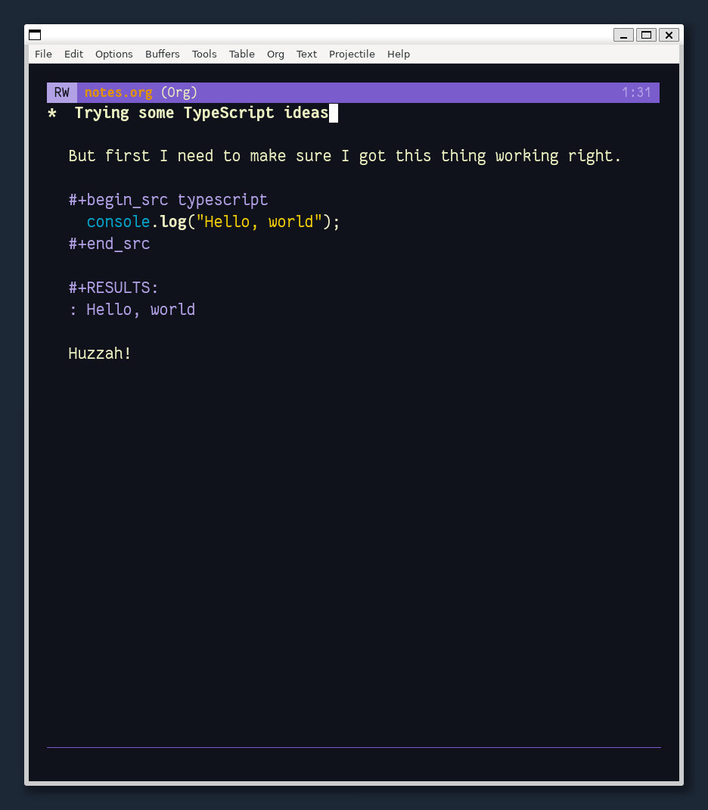

Got Org Babel playing nice with TypeScript thanks to [ob-typescript](https://github.com/lurdan/ob-typescript). It's a wild Saturday morning here.


Takes a bit to get there on WSL but the code *does* run

<!--more-->

That required a few more lines in my config, but not *too* many.

````lisp
(use-package ob-typescript)
(use-package org
  ;; ...
  :config
  (org-babel-do-load-languages
    'org-babel-load-languages
    '((typescript . t))))
````

I also followed my own advice from [2022-05-12-thu-2302](../05/2022-05-12-thu-2302.md), and added [Tide](https://github.com/ananthakumaran/tide) for TypeScript support in Emacs. Just copied and pasted from all the links, so config's a bit of a mess.

Oh hey that's right I still need to take my ADHD meds. I'll go do that now.
